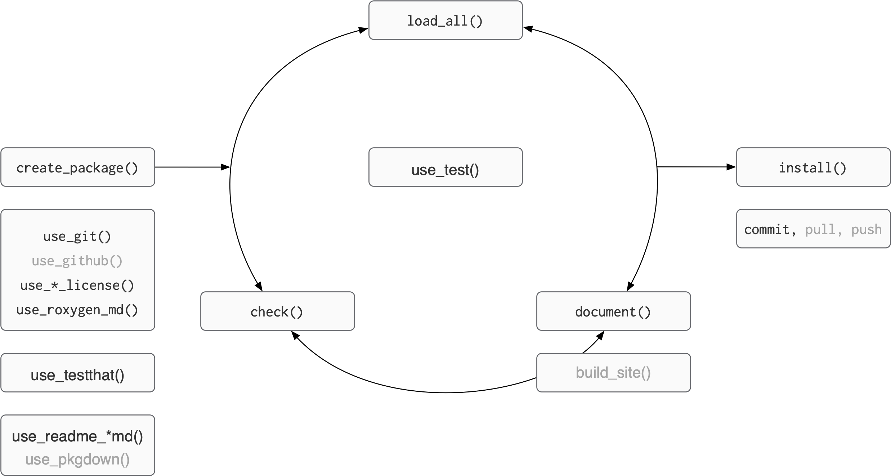

## Playing the whole game

::: {.teach-left}
```{r verb-all, echo=FALSE, eval=TRUE, fig.align='left'}

```

:::

::: footer 
Figure adapted from [Packages](https://github.com/hfrick/presentations/blob/master/2019-03-12_package_building/2019-03-12_package_building.pdf), by Hannah Frick
::: 


::: {.teach-right} 



:::

# Best and good enough

## Best practices for scientific computing 

:::::: columns
:::: {.column width="50%"}
::: small
Write programs for people, not computers.

  - A program should not require its readers to hold more than a handful of facts in memory at once.
  - Make names consistent, distinctive, and meaningful.
  - Make code style and formatting consistent.

Let the computer do the work.

  - Make the computer repeat tasks.
  - Save recent commands in a file for re-use.
  - Use a build tool to automate workflows.


:::
::::

:::: {.column width="50%"}
::: small

Make incremental changes.

  - Work in small steps with frequent feedback and course correction.
  - Use a version control system.
  - Put everything that has been created manually in version control. 
  
Don't repeat yourself (or others).

  - Every piece of data must have a single authoritative representation in the system.
  - Modularize code rather than copying and pasting.
  - Re-use code instead of rewriting it.
:::
::::

::::::

[Best Practices for Scientific Computing](https://journals.plos.org/plosbiology/article?id=10.1371/journal.pbio.1001745)


## Best practices for scientific computing 

:::::: columns
:::: {.column width="50%"}
::: small
Plan for mistakes.

  - Add assertions to programs to check their operation.
  - Use an off-the-shelf unit testing library.
  - Turn bugs into test cases.
  - Use a symbolic debugger.

Optimize software only after it works correctly.

  - Use a profiler to identify bottlenecks.
  - Write code in the highest-level language possible.


:::
::::

:::: {.column width="50%"}
::: small

Document design and purpose, not mechanics.

  - Document interfaces and reasons, not implementations.
  - Refactor code in preference to explaining how it works.
  - Embed the documentation for a piece of software in that software.

Collaborate.

  - Use pre-merge code reviews.
  - Use pair programming when bringing someone new up to speed and when tackling particularly tricky problems.
  - Use an issue tracking tool.
    
:::
::::

::::::

[Best Practices for Scientific Computing](https://journals.plos.org/plosbiology/article?id=10.1371/journal.pbio.1001745)

## Good enough practices for scientific computing {.smaller}

:::::: columns
:::: {.column width="50%"}
::: small

Data management

  - Save the raw data.
  - Ensure that raw data are backed up in more than one location.
  - Create the data you wish to see in the world.
  - Create analysis-friendly data.
  - Record all the steps used to process data.
  - Anticipate the need to use multiple tables, and use a unique identifier for every record.
  - Submit data to a reputable DOI-issuing repository so that others can access and cite it.
  
Manuscripts

  - Write manuscripts using online tools with rich formatting, change tracking, and reference management.
  - Write the manuscript in a plain text format that permits version control.

    
:::
::::
    
:::: {.column width="50%"}
::: small
Software

  - Place a brief explanatory comment at the start of every program.
  - Decompose programs into functions.
  - Be ruthless about eliminating duplication.
  - Always search for well-maintained software libraries that do what you need.
  - Test libraries before relying on them.
  - Give functions and variables meaningful names.
  - Make dependencies and requirements explicit.
  - Do not comment and uncomment sections of code to control a program's behavior.
  - Provide a simple example or test data set.
  - Submit code to a reputable DOI-issuing repository.
    

:::

::::

:::::

[Good enough practices in scientific computing](https://journals.plos.org/ploscompbiol/article?id=10.1371/journal.pcbi.1005510)


## Good enough practices for scientific computing {.smaller}

:::::: columns
:::: {.column width="50%"}
::: small
Collaboration

  - Create an overview of your project.
  - Create a shared "to-do" list for the project.
  - Decide on communication strategies.
  - Make the license explicit.
  - Make the project citable.


Project organization

  - Put each project in its own directory, which is named after the project.
  - Put text documents associated with the project in the doc directory.
  - Put raw data and metadata in a data directory and files generated during cleanup and analysis in a results directory.
  - Put project source code in the src directory.
 


    
:::
::::
    
:::: {.column width="50%"}
::: small

  - Put external scripts or compiled programs in the bin directory.
  - Name all files to reflect their content or function.

Keeping track of changes

  - Back up (almost) everything created by a human being as soon as it is created.
  - Keep changes small.
  - Share changes frequently.
  - Create, maintain, and use a checklist for saving and sharing changes to the project.
  - Store each project in a folder that is mirrored off the researcher's working machine.
  - Add a file called CHANGELOG.txt to the project's docs subfolder.
  - Copy the entire project whenever a significant change has been made.
  - Use a version control system.


:::

::::

:::::

[Good enough practices in scientific computing](https://journals.plos.org/ploscompbiol/article?id=10.1371/journal.pcbi.1005510)


## "Everything I know is from Jenny Bryan"

:::: {.columns}

::: {.column width="50%"}


[mytwitterarchive](https://www.amelia.mn/mytwitterarchive/AmeliaMN/status/805832755372261377/)
:::

::: {.column width="40%"}


[EIKSFJB hex sticker](https://github.com/MonkmanMH/EIKIFJB)
:::

::::

## `rm(list = ls())` -> computer on fire


> If the first line of your R script is
>
> `setwd("C:\Users\jenny\path\that\only\I\have")`
>
> I will come into your office and SET YOUR COMPUTER ON FIRE 🔥.
>
> If the first line of your R script is
>
> `rm(list = ls())`
>
> I will come into your office and SET YOUR COMPUTER ON FIRE 🔥.

> -- Jenny Bryan, [Project-oriented workflow](https://tidyverse.org/blog/2017/12/workflow-vs-script/)


## Code styling

Many (most?) people have coalesced around the [tidyverse style guide](https://style.tidyverse.org/). 

You can use the {styler} package to automatically style your code. Once it is installed, you get additional Addins in RStudio.

Style Active File

Style Package (!!)

. . .

Let's try styling our package, and then look at the diff

## Commit

Now would be a good time to commit your changes 

{fig-alt="Git icon" width="300"} 


## Naming functions

If writing a smaller package, consider prefixing your functions:

 - {BLT}: `BLT_perc_missing()`
 

. . .

Use a *verb* next:

 - `dplyr::mutate()`, `stringr::str_split()`

. . . 

Use a *noun* if building up a specific type of object:

 - `ggplot2::ggplot()`, `ggplot2::geom_point()`

## Casing

- Tidyverse uses `snake_case`; Shiny prefers `camelCase`

- Python prefers `snake_case`

- JavaScript prefers:
  - `camelCase` for functions 
  - `PascalCase` for classes, interfaces

. . . 

Pick a convention according to your domain, follow it.

## Arguments

Here, `mtcars` is an *argument*:

```r
head(mtcars)
```

. . . 

Here, `data` is a *formal argument*:

```r
head <- function(data){
  ...
}
```

. . .

In R, we sometimes use these terms interchangeably; we sometimes use the term *formals*. 

. . .

`¯\_(ツ)_/¯`

## Naming arguments

Like naming functions, strive to be:

- consistent
- evocative
- concise

. . .

> There are only two hard things in Computer Science: cache invalidation and naming things.
>
> -- Phil Karlton

. . .

> And off-by-one errors -- [Leon Bambrick](https://twitter.com/secretGeek/status/7269997868)

## Ordering arguments

- **data**: first argument, "the thing" 
- **descriptors**: values the user should specify
- **dots** (`...`): stuff that gets passed to other functions
- **details**: values with defaults

. . . 

I have seen the order of **dots** and **details** reversed.

However, **data** and **descriptors** almost always come first.

## Discuss with neighbour

Which are: data, descriptors, details?

```r
# there are acutally more args...
pivot_longer <- function(
  data,                
  cols,                
  names_to = "name",   
  names_prefix = NULL  
) {
  ...
}
```

## Discuss with neighbor (answer)

Which are: data, descriptors, details?

```r
# there are acutally more args...
pivot_longer <- function(
  data,                # data
  cols,                # descriptor
  names_to = "name",   # details
  names_prefix = NULL  #
) {
  ...
}
```


## Pure function

A function where:

 - the return value depends *only* on argument values

 - only change is the return value

. . .

Examples:

. . .
 
```r
function(x, y) {
  x + y
}
```

. . .
 
```r
cos(pi)
```

## Side effects

A function where:

 - the return value can depend on "the outside universe"

 - there is a change in the "the outside universe"
 
. . .

Examples:

. . .

```r
readr::read_csv("myfile.csv")
```

. . .

```r
runif(1)
```

## Why is this important?

. . . 

- Pure functions easier to test than functions with side effects.

. . . 

- Side effects (interactions with universe) take time (Shiny).

. . . 

- Functions with side effects should document the effects.

. . . 

- Side effects are not inherently bad (we *do* need to write to the file system),
  but they need extra care.
  
  
## Make a function with side effects

So far, our functions have been pure. Let's make one that is not. For this function, I want to write a wrapper around `imputeTS::ggplot_na_distribution()`. This function has the name `ggplot` in the title, but it doesn't work like a normal `ggplot()` function (taking the data as the first argument, then `aes`thetics). 

. . .

Do you remember the `usethis` function that will open up a .R file for us to write `BLT_ggplot_na_distribution.R`?

. . . 

```{r}
usethis::use_r()
```


Let's start with adding a function skeleton,

. . .

```r
BLT_ggplot_na_distribution <- function(data, mapping, ...){

}
```

. . . 

And then write some documentation **first**, as is better practice. 

## Make a function with side effects

::: extrasmall
```r
#' ggplot to visualization the distribution of missing values
#'
#' Wrapper around [imputeTS::ggplot_na_distribution]
#'
#' @param data Default dataset to use for a plot
#' @param variable The variable to plot
#' @param ... Other arguments passed on to methods
#'
#' @returns a ggplot object
#' @export
#'
#' @examples
#' tomatoes |>
#' BLT_ggplot_na_distribution(value)
BLT_ggplot_na_distribution <- function(data, variable, ...){

}
```
:::


## Make a function with side effects

::: extrasmall
```r
#' ggplot to visualization the distribution of missing values
#'
#' Wrapper around [imputeTS::ggplot_na_distribution]
#'
#' @param data Default dataset to use for a plot
#' @param variable The variable to plot
#' @param ... Other arguments passed on to methods
#'
#' @returns a ggplot object
#' @export
#'
#' @examples
#' tomatoes |>
#' BLT_ggplot_na_distribution(value)
BLT_ggplot_na_distribution <- function(data, variable, ...){
  var <- rlang::enquo(variable)
  var_eval <- rlang::eval_tidy(var, data = data)
  imputeTS::ggplot_na_distribution(var_eval)
}
```
:::


## Practical advice

Try to separate tasks into pure functions and side effects:

- easier to test the pure functions and side effects separately

- use *these* functions in higher-level functions


## Summary

. . .

- **Naming**: be consistent, concise, yet evocative.

. . .

- **Argument order**: data, descriptors, dots, details.
  
. . .

- **Return value type**: be consistent, predictable.

. . .

- Easy to remember data (first) argument and return value:
  - easy to use pipe, `|>`.

. . .

- Be mindful of side effects.

## Errors

- The most common type of side-effect is the **error condition**. 

. . .

- Sometimes, error messages can be cryptic: 

  ```r
  seq[10]
  ```

  ```
  Error in seq[10] : object of type 'closure' is not subsettable
  ```

. . . 


- You can write error messages that make things clearer for: 
  - developers who call your functions
  - end users
  
Object of type 'closure' is not subsettable, Jenny Bryan. rstudio::conf [video](https://posit.co/resources/videos/object-of-type-closure-is-not-subsettable), [slides](https://speakerdeck.com/jennybc/object-of-type-closure-is-not-subsettable)

## Creating an error condition 

An effective error condition has:

- **predicate** (logical expression used to identify condition)
- clear **message** for end user
- **class name** for developer
- **more information** for developer

## Using `cli::cli_abort()`

{cli} package 

```r
# predicate
if (y > 3) {
  cli::cli_abort(
    # message for end user
    c(
      "{.var y} cannot be greater than 3.", 
      x = "{.var y} is {.val {y}}."
    ),
    # class name
    class = "BLT_error_threshold",  
    # more information
    y = y     
  )
}
```

## Predicate

Prefer:

 - simpler predicates and more error-conditions
 
Over:

 - complex predicates and fewer error-conditions
 
. . .

Finding simplest set of predicates is just as challenging as finding the "right" names for functions and arguments.

## Message

Content:

- how did we violate the predicate?

. . . 

Formatting:

- {cli} provides powerful formatting tools:

  - use curly-braces and a tag, e.g. `{.var y}` 
  - use more curly-braces to interpolate, e.g. `{.val {y}}`
  
- see [cli inline-markup](https://cli.r-lib.org/reference/inline-markup.html) for more details.

## Class name

- A developer, calling your function, can use the `class` name to handle the error, if they want.

- Convention: 
  
  - `"{package}_error_{description}"`

## Additional information

This "stuff" is also available to an error handler.

- Provide the data that went into the predicate.

- Provide name of variable, e.g. `y = y`.

- Avoid reserved names: `message`, `class`, `call`, `body`, `footer`, `trace`, `parent`, `use_cli_format`.

## Validation

If there will be an error, surface it quickly.

Validating the arguments to a function is one way to do this.

. . .

For example:

 - is *this* a data frame?
 - does this data frame have *these* columns?

. . . 
 
Questions like these can be generalized into functions:

 - throw an error if you need to.
 - otherwise, return **data** argument invisibly.
 
## Validate string-values 

You may be familiar with `match.arg()`:

 - uses "magic" to compare value (if any) to default
 - argument default is vector of strings
   - if value among defaults, return it - otherwise **error**
   - if no value, return *first* value in default

. . .

`rlang::arg_match()` does the same thing, but:

  - partial match triggers error
  - error messages conform to tidyverse standards

## Snapshot tests

Designed for capturing side-effects:

 - error messages
 - `dplyr::glimpse()` is a useful shortcut
 
. . .  
 
Be careful about accepting changes (don't just accept).

Can be temperamental - not run on CRAN.

We will go through, using examples.
   


<!-- ## Build error constructor {.smaller} -->

<!-- - `usethis::use_package("cli")` -->

<!-- - review `validate_data_frame()` (`call` argument) -->

<!-- - build constructor for `validate_cols()`: -->
<!--   - something like `{.field {cols}}` may be useful -->
<!--   - activate `2.2.1` tests in `test-validate.R`, as you go -->

<!-- - hold off on snapshot test (we'll do together) -->

<!-- . . . -->

<!-- - add validator-functions to `uss_make_matches()`: -->
<!--   - `matches.R` -->
<!--   - `cols_engsoc()` may be useful -->

## Managing global state

Leave no footprints.

Leave the global state how you found it, avoid surprises later:

 - packages loaded
 - also: options, environment variables 

. . .

Loading {devtools} in `.Rprofile` changes the global state.

. . .

When we hit the "Knit" button, or the Quarto "Render" button:

  - it runs in a *new* R session
  - does not execute user's `.Rprofile`
  
## Using "self-removing footprints"

The {withr} package gives us tools to:

 - modify global state
 - specify when to reverse the modification

. . . 
 
Useful family of functions:

 - `withr::local_*()`
 - changes the state back when a scope is exited
 - if called within a function, *normally* when the function exits

## When could this be useful?

CRAN is (rightly) particular about "leave no footprints".

You may need:

 - `withr::local_options()`: change an option
 - `withr::local_dir()`: change the working directory
 - `withr::local_tempfile()`: path to a temporary file
 
. . . 

Useful in `testthat` code and in `R` code.

## Interactive example

```{r}
write_read_vanish <- function(x) {
  
  tempfile <- withr::local_tempfile(fileext = ".rds")
  
  saveRDS(x, file = tempfile)
  xnew <- readRDS(tempfile)
  
  print(
    glue::glue("'{tempfile}' contained {xnew}.")
  )
  
  invisible(xnew)
}
```

## Another interactive example

```r
not_runif <- function(n, min = 0, max = 1) {

  withr::local_seed(314)
  
  runif(n, min = min, max = max)
}
```

## Example

- `usethis::use_test("validate")`
- change: 

  ```r
  expect_identical(error_condition$cols_req, "foo")
  ```
  
- to: 

  ```r
  expect_identical(error_condition$cols_re, "foo")
  ```

- rerun tests 🤔

. . . 

- By default, `$` accepts partial matching.

- We want stricter testing, so we need to set some options.


## Test a function with side effects 

It's much harder to write tests for functions that have side effects. But, there are some new helpers out there. `vdiffr` is what is being used to test `ggplot2`. It has the function `expect_doppleganger()` that can compare snapshots of figures. 


Do you remember the `usethis` function that will make a test file for us?

. . . 

```r
 usethis::use_test()
```

. . . 

```r
test_that("plots have known output", {

  tomato_NA_dist <- BLT_ggplot_na_distribution(tomatoes, value)
  vdiffr::expect_doppelganger("tomato_NA_dist", tomato_NA_dist)
})
```

. . .

```r
test()
```

does it pass?

## Test a function with side effects 

If you want to see it break, we can change the dataset in the test

```r
test_that("plots have known output", {

  tomato_NA_dist <- BLT_ggplot_na_distribution(bacon, value)
  vdiffr::expect_doppelganger("tomato_NA_dist", tomato_NA_dist)
})
```

. . .

```r
test()
```

Should fail!

## Commit

Now would be a good time to commit your changes 

{fig-alt="Git icon" width="300"} 

## Pass the dots

This is the simplest possible solution. 

. . .

 - If the tidyverse function you're using takes `...` as an argument,

. . .

 - and that's what you want to pass along, 

. . . 
 
then you can **pass the dots**.

```r
my_select <- function(.data, ...) {
  dplyr::select(.data, ...)
}
```

## Data in packages

There is a lot more detail specific to including data in packages. Sometimes you want to include raw data, sometimes you need data only available to the package and not the user, etc. There is much more detail in the [R packages](https://r-pkgs.org/data.html) book. 


## Summary

. . .

The most-common side-effect is an error. Good design:

. . .

- simple (as possible) predicate
- clear message
- add a `class` using naming convention, and additional information

. . .

Use snapshot tests to capture side-effects.

- be very careful when accepting changes to snapshots.

. . . 

Use `withr::local_*()` functions to "leave no footprints".


## Resources

- [Best Practices for Scientific Computing](https://journals.plos.org/plosbiology/article?id=10.1371/journal.pbio.1001745)
- [Good enough practices in scientific computing](https://journals.plos.org/ploscompbiol/article?id=10.1371/journal.pcbi.1005510)
- Object of type 'closure' is not subsettable, Jenny Bryan. rstudio::conf [video](https://posit.co/resources/videos/object-of-type-closure-is-not-subsettable), [slides](https://speakerdeck.com/jennybc/object-of-type-closure-is-not-subsettable)

- [Code "smells" and feels](https://www.youtube.com/watch?v=7oyiPBjLAWY), Jenny Bryan
