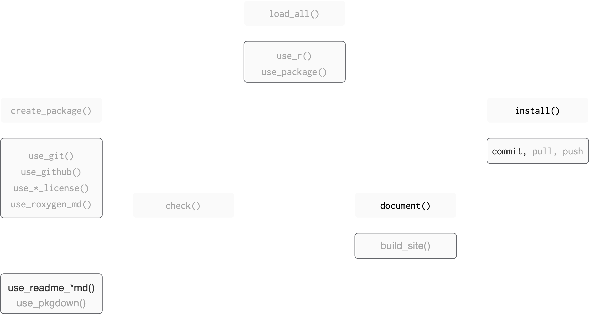

## Where we left off

::: {.teach-left}
```{r verb-base, echo=FALSE, eval=TRUE, fig.align='left'}
knitr::include_graphics("img/img-verbs/base.png")
```

:::

::: footer 
Figure adapted from [Packages](https://github.com/hfrick/presentations/blob/master/2019-03-12_package_building/2019-03-12_package_building.pdf), by Hannah Frick
::: 


::: {.teach-right} 

:::

## Where we're heading

::: {.teach-left}
```{r verb-document, echo=FALSE, eval=TRUE, fig.align='left'}

```

:::

::: footer 
Figure adapted from [Packages](https://github.com/hfrick/presentations/blob/master/2019-03-12_package_building/2019-03-12_package_building.pdf), by Hannah Frick
::: 


::: {.teach-right} 

:::


# 🏷️ Document your package


## Levels of package documentation

- Metadata: The `DESCRIPTION` file -- "what's in this package?"

- Object documentation: for functions and data

- Package-level documentation

<!-- for each of the exported functions and datasets in the package, along with examples of usage -->

- Vignettes: Long form documentation

<!-- generally discussing how to use a number of functions from the - package together and/or how a package fits into a larger ecosystem of packages -->

# `DESCRIPTION`

## Metadata in `DESCRIPTION`

- Title: One line, title case, with no period. Fewer than 65 characters.

- Version

- for release: MAJOR.MINOR.PATCH version.

- for development version: MAJOR.MINOR.PATCH.9000

- Authors\@R:

- "aut" means author, "cre" means creator, "ctb" means contributor.

::: aside
to be continued.....
:::

## Edit `DESCRIPTION` (your turn)

::: {.teach-left}

Open `DESCRIPTION` file to edit it:

- `Authors@R` field uses `options("usethis.description")` 

   - we set this in our `.Rprofile`, so go back to the intro slides if you missed this!

✏️ edit `Title` field. Should be one line, title case, with no period. Fewer than 65 characters.

💾 save `DESCRIPTION` file

:::

::: {.teach-right} 



:::


## Edit `DESCRIPTION`

::: small
``` default
Package: BLT
Title: Work with data on bacon, lettuce, and tomatoes
Version: 0.0.0.9000
Authors@R: 
    person("Amelia", "McNamara", , "amelia.mcnamara@stthomas.edu", role = c("aut", "cre"))
Description: What the package does (one paragraph).
License: `use_mit_license()`, `use_gpl3_license()` or friends to pick a
    license
Encoding: UTF-8
Roxygen: list(markdown = TRUE)
RoxygenNote: 7.3.3
```
:::


## Metadata in `DESCRIPTION`

- Description: One paragraph describing what the package does. Keep the width of the paragraph to 80 characters; indent subsequent lines with 4 spaces.

- License

- Encoding: How to encode text, use UTF-8 encoding.

- LazyData: Use true to lazy-load data sets in the package.


## Edit `DESCRIPTION`

🎬 Edit the description

. . .

``` default
Description: This is a demo package for the "Code you can bank on" 
    workshop at the Federal Reserve. It allows you to work with time series 
    data, and example datasets on bacon, lettuce, and tomatoes. 
```

. . .

👀 The full stop matters!


## Add a license {.smaller}

::: {.teach-left}

```r
use_mit_license()
```

- lets the world know how it can use the stuff you create

  - CRAN requires you to specify a (valid) license
  - May be less relevant in your usecase!

- other choices include 
 
  - `use_apl2_license()`: Apache 2.0
  - `use_gpl3_license()`: GPL3

- uses `option("usethis.full_name")` or `option("devtools.name")` 
  - we set this in `.Rprofile`

:::


::: {.teach-right} 



:::


## Commit

Now would be a good time to commit your changes.

\


{fig-alt="Git icon" width="300"} 


# Object documentation


## Object documentation

- Object documentation is what you see when you use `?` or `help()`

. . .

🎬 Try this now:

```{r}
?AR1
```

🎬 Contrast with this:

```{r}
?parse_number
# or ?readr::parse_number
```

. . .

- Files are written in a special "R documentation" format: `.Rd`

- `.Rd` resembles LaTeX

## .Rd example

Here's `parse_number.Rd` from the `readr` package

::: extrasmall
```
% Generated by roxygen2: do not edit by hand
% Please edit documentation in R/collectors.R
\name{parse_number}
\alias{parse_number}
\alias{col_number}
\title{Parse numbers, flexibly}
\usage{
parse_number(x, na = c("", "NA"), locale = default_locale(), trim_ws = TRUE)

col_number()
}
\arguments{
\item{x}{Character vector of values to parse.}

\item{na}{Character vector of strings to interpret as missing values. Set this
option to \code{character()} to indicate no missing values.}

\item{locale}{The locale controls defaults that vary from place to place.
The default locale is US-centric (like R), but you can use
\code{\link[=locale]{locale()}} to create your own locale that controls things like
the default time zone, encoding, decimal mark, big mark, and day/month
names.}
```

:::

## Object documentation

::: {.teach-left}

🥳 We don't have to write it!!

- We write "roxygen comments" in the `.R` files

- These get turned into `.Rd` format

- Functions from **`roxygen2`** do the work but we can use **`devtools`** functions to call them.

```r
use_roxygen_md()
```

- makes it **much** easier to create and maintain your function documentation

- lets you use a markdown-like syntax


:::

::: {.teach-right} 


<!-- Fix image -->

```{r}
#| ref.label: noun-framework
#| echo: false
#| eval: true
```
:::


## Object documentation workflow

- Insert roxygen skeleton to `.R` files
- Add roxygen comments
- the `#'` indicates it is a roxygen comment

. . .

- Run `devtools::document()` to convert roxygen comments to `.Rd` files.

. . .

- Load the package with `devtools::load_all()`

. . .

- Preview documentation with `?`

. . .

- Repeat until the documentation looks the way you want.


## Roxygen comments and tags

- `#'` indicates it is a roxygen comment

- `@` indicates a roxygen tag

  - `@param arg` --- describe the inputs
  - `@examples`--- show how the function works
  - `@seealso` --- point out related functions
  - `@return` --- describe the outputs
  - `@export` --- is this a user visible function

## Document your function

Open `AR1.R` (`use_r()` will do it if you don't want to click)

Place your cursor on a blank line between the `{` ✏️ `}` 

RStudio IDE menu: **Code** > **Insert Roxygen Skeleton**

\

🎬 Give your function a title and a brief description

\

🎬 Define the parameter(s)

\

🎬 Describe what the function returns

## Our answer

::: small
``` default
#' Convenience function to make first-order autoregressive model
#'
#' Wrapper around forecast::Arima
#
#' @param y a univariate time series of class `ts`
#'
#' @returns See the Arima function in the forecast package
#' @export
#'
#' @examples
#'

```
:::

. . .

\

🎬 Save `AR1.R`

## Build documentation

::: {.teach-left}

🎬 Run `devtools::document()` to turn roxygen comments to `.Rd`

```{r}
devtools::document()
```


``` default
ℹ Updating BLT documentation
ℹ Loading BLT
Writing NAMESPACE
Writing AR1.Rd
Warning message:
[AR1.R:13] @examples requires a value 
```

We will that fix later!

:::

::: {.teach-right}



:::


- `NAMESPACE` now lists the exported function

- `man/AR1.Rd` has been written

## Take a look

🎬 Load the package : `devtools::load_all()`

\

🎬 Preview the documentation with:

```{r}
?AR1
```

. . .

\

😮 🥳

## Fix warning

``` default
Warning message:
[matches.R:13] @examples requires a value 
```

. . .

We need to add a usage example!

🎬 Under `@examples`, add one example for using your function

. . .

``` default
#' @examples
#' (AR1(LakeHuron))
```

## Look again

🎬 Save `AR1.R`, run `devtools::document()` followed by `devtools::load_all()`

\

. . .

🎬 Preview the documentation with `?AR1` and edit if needed

## Getting fancier

So far, we've just written plain text in our documentation. But if you have spent time exploring R help pages, you will remember that there are often links. We can add those to our documentation, as well.


::: small
``` default
#' Convenience function to make first-order autoregressive model
#'
#' Wrapper around [forecast::Arima]
#
#' @param y a univariate time series of class `ts`
#'
#' @returns See the [`Arima`][forecast::Arima] function in the `forecast` package
#' @export
#'
#' @examples
#' (AR1(LakeHuron))

```
:::


[function links](https://roxygen2.r-lib.org/articles/rd-formatting.html?q=link#function-links)

```r
document()
load_all()
check()
```

## More documentation

Take a few minutes and document your other functions. Recall:

RStudio IDE menu: **Code** > **Insert Roxygen Skeleton**

```
document()
load_all()
check()
```

Bonus: add examples for each

## Commit

Now would be a good time to commit your changes 

{fig-alt="Git icon" width="300"} 


# Package-level help page

## Package-level help page

🎬 What happens if you do:

```{r}
?BLT
```

. . .

``` default
No documentation for 'BLT' in specified packages and libraries:
you could try '??BLT'
```

. . .

Contrast that with 

```{r}
?ImputeTS
```


## Package-level help page

::: {.teach-left}

We can fix this with `use_package_doc()`\


🎬 Add a package-level help page:

```{r}
usethis::use_package_doc()
```


\

``` default
✔ Writing 'R/BLT-package.R'
• Modify 'R/BLT-package.R'
```


\

🎬 Run `devtools::document()` then `devtools::load_all()` followed by `?BLT`

:::

::: {.teach-right}



:::


## `devtools::check()`

This is a good time to run R CMD check to ensure our package is in full working order.

. . .

🎬 Use **`devtools`** to run R CMD check

. . .

```{r}
devtools::check()
```

## Commit

Now would be a good time to commit your changes 

{fig-alt="Git icon" width="300"} 

# Documenting data

## Documenting data

Data gets documented in the `data.R` file. How can we create and open this file for editing?

. . .

```r
use_r("data")
```

Unfortunately, the trick to insert Roxygen skeleton doesn't work with data, so we have to do the documentation more manually. 

## Documenting data

Here's what the `who` documentation in `tidyr` looks like

::: small
```
#' World Health Organization TB data
#'
#' A subset of data from the World Health Organization Global Tuberculosis
#' Report ...
#'
#' @format ## `who`
#' A data frame with 7,240 rows and 60 columns:
#' \describe{
#'   \item{country}{Country name}
#'   \item{iso2, iso3}{2 & 3 letter ISO country codes}
#'   \item{year}{Year}
#'   ...
#' }
#' @source <https://www.who.int/teams/global-tuberculosis-programme/data>
"who"
```

:::

Can you write some documentation for the `bacon` data?

## Documenting data (your turn)


::: {.teach-left}

::: small
```
#' FRED bacon price data
#'
#' A subset of data on the average price of sliced bacon in the US.
#' Data is from 2016 to 2026
#'
#' @format ## `bacon`
#' A data frame with 119 rows and 5 columns:
#' \describe{
#'   \item{date}{Date of observation}
#'   \item{series_id}{APU0000704111, the series ID for the series}
#'   \item{value}{the average price of bacon at that date}
#'   \item{real_timestart, realtime_end}{the date the data was downloaded}
#' }
#' @source <https://fred.stlouisfed.org/series/APU0000704111>
"bacon"
```

:::

:::

::: {.teach-right}


:::


## Commit

```
document()
load_all()
check()
```

Now would be a good time to commit your changes 

{fig-alt="Git icon" width="300"} 


# Package dependencies

## Package dependencies

So far, we have just used `use_package()` to add Imports to our package. But, there are multiple levels of dependency possible.  

- **Imports:** must be installed for your package to work. If they're not, they will get installed.

- **Suggests:** used by your package, but not required. Might provide data for examples, to run tests, build vignettes.

- **Depends:** Avoid where possible. When your package requires a specific version of R, e.g. `Depends: R (>= 3.4.0)`. Think critically: downstream effects on packages that depend on your package.


## Importing functions

We used `imputeTS::statsNA()` multiple times in our package.

. . .

Instead of using:

```{r}
usethis::use_package("imputeTS")
```

. . .

we can use

```{r}
usethis::use_import_from("imputeTS", "statsNA")
```

. . .

which will:

- to add the package to the `DESCRIPTION` imports
- add `@importFrom imputeTS statsNA` to `BLT-package.R` and `NAMESPACE`
- mean we can avoid `::`

## `@importFrom pkg fun`

🎬 Import `tibble()` from **`tibble`**:

```{r}
usethis::use_import_from("imputeTS", "statsNA")
```

. . .

``` default
✔ Adding 'imputeTS' to Imports field in DESCRIPTION
✔ Adding '@importFrom imputeTS statsNA' to 'R/BLT-package.R'
✔ Writing 'NAMESPACE'
✔ Loading BLT
```

## Importing functions

Now, we could go back and remove the `imputeTS::` piece of our code. 

## Suggests

- Are used by your package, but not required for it to work

- Might provide data for examples

```{r}
usethis::use_package("package-name",
                     type = "Suggests")
```

- Packages listed in Suggests are not automatically installed along with your package.

- This means that you can't assume the package is available


## Commit

Now would be a good time to commit your changes 

{fig-alt="Git icon" width="300"} 

# Additional documentation for packages

## Additional documentation for packages

-   `README.md`: Really useful when sharing things on GitHub or GitLab. Can be the first file read by the user.

-   Vignette: A long-form guide to your package. Can describe the problem that your package is designed to solve, and then show the reader how to solve it.

-   Package website


# README

## `README.md`

Big picture goes in the README:

-   High-level purpose of the package
-   Simple example
-   Installation instructions
-   Description of main features with links to vignettes

## `README.rmd`

You are likely to have code in the `README.md`

. . .

Generating it with RMarkdown or Quarto is helpful

. . .

`usethis` helps out again!

. . .

`usethis::use_readme_rmd()` will:

-   generate a template `README.Rmd` which
    -   outputs a GitHub markdown doc
    -   contains reminders of things to include
    -   has tips

-   adds the `README.Rmd` to the `.Rbuildignore`
-   adds a "pre-commit" hook to ensure you knit to `md` before committing


If you would prefer to work in Quarto, you can! But you'll have to make the file yourself. 

## Add a `README.Rmd`

🎬 Add a `README.Rmd` with:

```{r}
usethis::use_readme_rmd()
```

. . .

``` default
✔ Writing 'README.Rmd'
✔ Adding '^README\\.Rmd$' to '.Rbuildignore'
• Modify 'README.Rmd'
✔ Writing '.git/hooks/pre-commit'
```

## Template

🎬 Examine your `README.Rmd`

. . .

-   GitHub markdown
-   reminder to edit `README.Rmd` rather than `README.md`
-   Sets up some recommended knitr options

## 

```{r}
#| echo: fenced
knitr::opts_chunk$set(
  collapse = TRUE,
  comment = "#>",
  fig.path = "man/figures/README-",
  out.width = "100%"
)
```

## Render

You need to render `README.Rmd` regularly, to keep `README.md` up-to-date.

`devtools::build_readme()` is handy for this.

. . .

🎬 Render with `README.md`:

```{r}
devtools::build_readme()
```

. . .

``` default
ℹ Installing BLT in temporary library
ℹ Building /Users/amcnamara2/BLT/README.Rmd
```

## `devtools::build_readme()`

-   creates `README.md`
-   creates `man/figures/README-pressure-1.png`

## Edit `README.Rmd`

🎬 Complete: "The goal of BLT is to ..."

\

🎬 Add: an example with `AR1()`


🎬 Remove: non-relevant sections

## An answer

Complete: "The goal of BLT is to ..."

``` default
The goal of BLT is to provide helper functions for time series analysis, to work on data about bacon, lettuce, and tomatoes. 
```

. . .

Add: an example with `AR1()`

```{r example}
#| echo: fenced
library(BLT)
AR1(tomatoes$value)
```

. . .

Remove: non-relevant sections

Everything after "What is special about using......"

## Commit

Now would be a good time to commit your changes.

\


{fig-alt="Git icon" width="300"} 


## Add a badge to the `README.Rmd` (we're skipping this){style="color: #888888;"}

Badges give information to the user about the state of the package

For example: [{width="200" height="26"}](R%20cmd%20check%20badge)

To add this badge, we set up a "GitHub Action"

A GitHub Action is "continuous integration" which allows you to automate package building, testing and deployment on github

Actions we add are triggered when we push to GitHub.

## Adding a `R CMD check` action (we're skipping this){style="color: #888888;"} 

Adding the `R CMD check` action along with an edit to the `README.Rmd` will:

-   run `R CMD check` on multiple OS on GitHub and

-   add badge with the result to the `README.Rmd`

We can add with `usethis::use_github_action_check_standard()`


## `R-CMD-check.yaml` (we're skipping this) {style="color: #888888;"}

::: extrasmall
    # Workflow derived from https://github.com/r-lib/actions/tree/v2/examples
    # Need help debugging build failures? Start at https://github.com/r-lib/actions#where-to-find-help
    on:
      push:
        branches: [main, master]
      pull_request:
        branches: [main, master]

    name: R-CMD-check

    jobs:
      R-CMD-check:
        runs-on: ${{ matrix.config.os }}

        name: ${{ matrix.config.os }} (${{ matrix.config.r }})

        strategy:
          fail-fast: false
          matrix:
            config:
              - {os: macOS-latest,   r: 'release'}
              - {os: windows-latest, r: 'release'}
              - {os: ubuntu-latest,   r: 'devel', http-user-agent: 'release'}
              - {os: ubuntu-latest,   r: 'release'}
              - {os: ubuntu-latest,   r: 'oldrel-1'}

        env:
          GITHUB_PAT: ${{ secrets.GITHUB_TOKEN }}
          R_KEEP_PKG_SOURCE: yes

        steps:
          - uses: actions/checkout@v2

          - uses: r-lib/actions/setup-pandoc@v2

          - uses: r-lib/actions/setup-r@v2
            with:
              r-version: ${{ matrix.config.r }}
              http-user-agent: ${{ matrix.config.http-user-agent }}
              use-public-rspm: true

          - uses: r-lib/actions/setup-r-dependencies@v2
            with:
              extra-packages: any::rcmdcheck
              needs: check

          - uses: r-lib/actions/check-r-package@v2
            with:
              upload-snapshots: true
:::


# Vignettes

## Vignettes

-   A long-form guide to your package.
-   Function documentation is useful if you know the function name
-   A vignette explains how to use your package
-   Can describe the problem that your package is designed to solve, and then show the reader how to solve it.

## Add a vignette

🎬 Add a vignette called "BLT" with

```{r}
usethis::use_vignette("BLT")
```

## What's happened?

::: small
``` default
✔ Setting active project to "/Users/amcnamara2/BLT".
✔ Adding knitr to Suggests field in DESCRIPTION.
✔ Adding "inst/doc" to .gitignore.
✔ Adding rmarkdown to Suggests field in DESCRIPTION.
✔ Adding "knitr" to VignetteBuilder.
✔ Creating vignettes/.
✔ Adding "*.html" and "*.R" to vignettes/.gitignore.
✔ Writing vignettes/BLT.Rmd.
☐ Modify vignettes/BLT.Rmd.
```
:::

## Edit `vignettes/BLT.Rmd`

🎬 Add info to `vignettes/BLT.Rmd`

## An answer

::: extrasmall
```{r setup}
library(BLT)
```

The goal of BLT is to provide some time series helper functions, which allow you to work with data on bacon, lettuce, and tomatoes. 

The package contains three sample datasets from FRED

```{r}
data(bacon)
data(lettuce)
data(tomatoes)
```

The function `AR1` is a convenience function to make a first-order autoregressive model. We can use this to model the bacon data

```{r}
AR1(bacon$value)
```

The function perc_missing allows you to compute the percent of a time series that is missing

```{r}
perc_missing(bacon$value)
```

Or, you can use the tidy version, `perc_missing_tidy()`

```{r}
perc_missing_tidy(bacon, value)

bacon |>
  perc_missing_tidy(value)
```
:::

## Preview the Vignette

🎬 Build the vignette with:

```{r}
devtools::build_rmd("vignettes/BLT.Rmd")
```

``` default
ℹ Installing BLT in temporary library
ℹ Building /Users/amcnamara2/BLT/vignettes/BLT.Rmd
[WARNING] Deprecated: --highlight-style. Use --syntax-highlighting instead.
```

(I'm choosing to ignore this warning-- it sounds like something for the `devtools` developers, not me.)


## Commit

Now would be a good time to commit your changes.

\


{fig-alt="Git icon" width="300"} 


# `pkgdown` sites (we're skipping this) {style="color: #888888;"} 

## `pkgdown` sites (we're skipping this) {style="color: #888888;"} 

`pkgdown` is designed to make it quick and easy to build a website for your package.


Examples

-   [palmerpenguins](https://allisonhorst.github.io/palmerpenguins/)

-   [ggplot2](https://ggplot2.tidyverse.org/)

Very widely used


Uses your existing documentation

-   Home page - from `README.md`
-   Get started - from overall pkg vignette
-   Function Reference - from documentation in `man/`
-   Articles - from other vignettes

## Commit

Now would be a good time to commit your changes.

\


{fig-alt="Git icon" width="300"} 


# Summary

## Summary

::: small
- A package has metadata and object documentation (essential), vignettes and **`pkgdown`** sites (optional)
- Metadata is in the `DESCRIPTION`
  - some fields need manual editing
  - some fields are appropriately edited by **`devtools`** workflow functions
- Objects like functions and data are documented with roxygen comments then turned into documentation with `devtools::document()`
  - roxygen comments are indicated with `#'`
  - roxygen tags start with `@`
:::


## Summary 

::: small
- Package dependencies need to be documented
  - package dependencies are added with `use_package()`
  - functions from dependencies are called with `pkg::function()`
  - we don't use `library()`
:::


## Summary

::: small
-   Always include a `README.md` with the purpose of the package, installation instructions and a simple example
-   `usethis::use_readme_rmd()` will generate a template `README.Rmd` and do other useful things
-   `devtools::build_readme()` will build `README.md` from `README.Rmd`
-   A GitHub Actions is a "continuous integration" tool which allows you to automate package building, testing and deployment on GitHub
-   `usethis::use_github_action_check_standard()` will add the `R CMD check` action and a badge
:::

## Summary

::: small
-   A vignette gives a more detailed explanation of how your package can be used
-   You can add a vignette with `usethis::use_vignette(name_of_vignette)`
-   **`pkgdown`** makes it quick and easy to build a website for your package from the existing documentation
-   `usethis::use_pkgdown()` configures your package to use a **`pkgdown`** website
-   `pkgdown::build_site()` will build the website so you can examine it locally
-   `usethis::use_pkgdown_github_pages()` sets up a GitHub action to automatically build and publish your site on pushing.
-   **`usethis`** really rocks!
:::

## Resources

- [R packages](https://r-pkgs.org/), Hadley Wickham and Jenny Bryan. 
