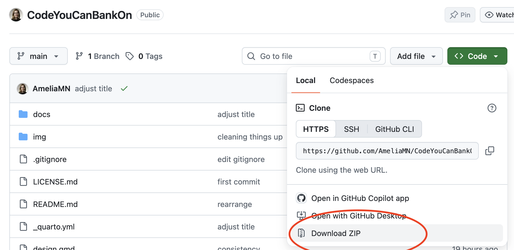
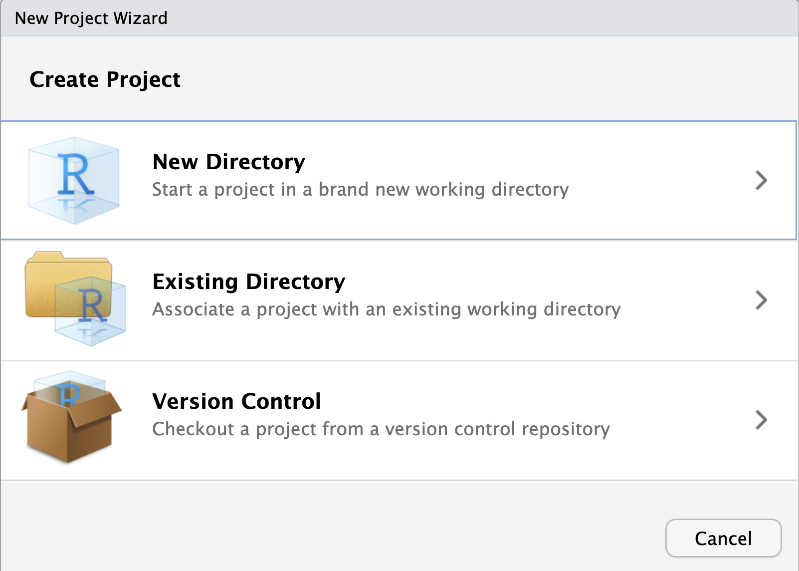
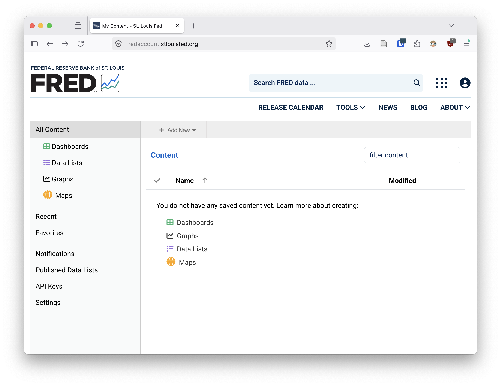
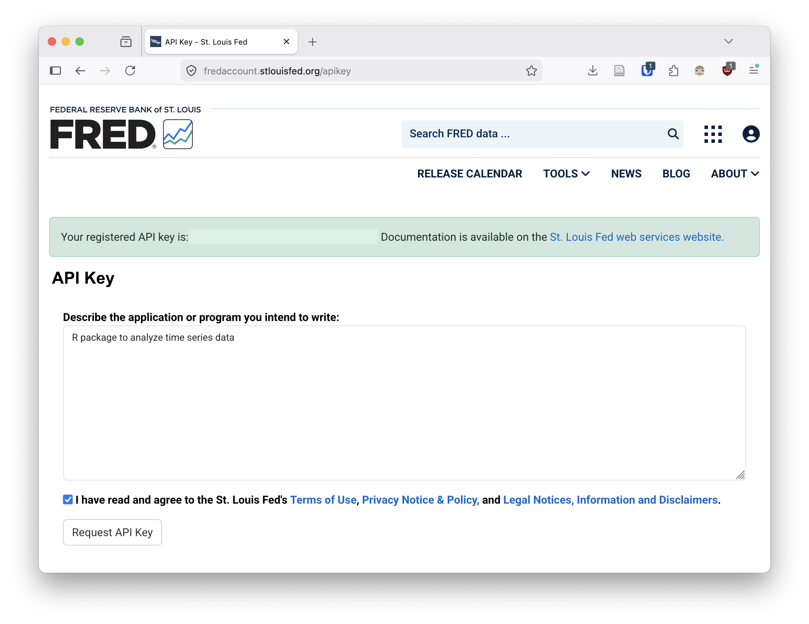

## Getting these materials {.smaller}

At least at first, it should be totally adequate to follow along with the slides I'm sharing on the screen. But I know people like to have all the materials! 

Everything is available on GitHub, <https://github.com/AmeliaMN/CodeYouCanBankOn>
/

If you are a git/GitHub user, you can fork and clone this repo.
/

If you're not, you can download everything as a zip file 



## About me

I'm an Associate Professor of data science at the University of St. Thomas, and a proud R-lady. I've taught a ton of workshops like this over the years, from Software Carpentry to rstudio::conf to NICAR and everything in between. 

\

The materials you'll be seeing from me have been modified from a number of sources, including:

- [Building tidy tools](https://github.com/rstudio-conf-2022/build-tidy-tools) workshop, Emma Rand and Ian Lyttle. 
- [uncoast::unconf](https://github.com/uncoast-unconf/uu-2019-day-zero) workshop, Ian Lyttle, Amelia McNamara, Haley Jeppson, and Yihui Xie, which in turn were based on [Hannah Frick's work](https://github.com/hfrick/presentations/blob/master/2019-03-12_package_building/)
- [R packages](https://r-pkgs.org/) book, by Hadley Wickham and Jenny Bryan.
- ... and likely many more things that I will reference throughout. 

---

:::: {.columns}

::: {.column width="50%"}


:::

::: {.column width="50%"}

One huge feature of the R community is that everyone is so generous with their time, expertise, and materials. Almost everything (including this workshop!) is Creative Commons licensed, so others can remix and reuse as they see fit. 

:::

::::


::: footer
Artwork by [Allison Horst](https://allisonhorst.com/everything-else)
:::


## "Everything I know is from Jenny Bryan"

:::: {.columns}

::: {.column width="50%"}

[mytwitterarchive](https://www.amelia.mn/mytwitterarchive/AmeliaMN/status/805832755372261377/)
:::

::: {.column width="40%"}

[EIKSFJB hex sticker](https://github.com/MonkmanMH/EIKIFJB)
:::

::::

## Prerequisite knowledge

I am assuming you have a baseline familiarity with

- R as a language
- Writing functions
- Markdown (RMarkdown/Quarto/plain Markdown)
- git/GitHub

## Catch up {.smaller}
I'll do a little bit of review of each of those topics, but if they are totally new to you, here is some background reading to help you get caught up. 

:::: {.columns}

::: {.column width="60%"}
- R as a language
  - [What is R?](https://fg2re.sellorm.com/whatisr.html)
  - [How to use R](https://learn.r-journalism.com/en/how_to_use_r/)
  - [R cookbook](https://rc2e.com/)
- Writing functions
  - [DRY](https://www.geeksforgeeks.org/software-engineering/dont-repeat-yourselfdry-in-software-development/)
  - [Functions](https://r4ds.hadley.nz/functions.html) chapter of R for Data Science
  - [What makes a good function?](https://www.youtube.com/watch?v=Qne86lxjgtg), Hadley Wickham
  - Nick Tierney's [Practical Functions, Practically Magic](https://github.com/njtierney/talk-funfun-slc)
:::

::: {.column width="40%"}
- Markdown
  - [RMarkdown](https://r4ds.had.co.nz/r-markdown.html) (mostly deprecated at this point)
  - [Quarto](https://r4ds.hadley.nz/quarto.html)
  - [Markdown](https://daringfireball.net/projects/markdown/syntax)
- [git](https://happygitwithr.com/big-picture)/[Github](https://happygitwithr.com/usage-intro)

:::

::::

## Packages

We're going to be using the following packages, so make sure they are installed!

```{r, eval=FALSE, echo=TRUE}
install.packages(c("forecast", "fredr", "imputeTS", "rlang", "roxygen2", "styler", "testthat", "tidyverse", "usethis", "vdiffr"))
```


# Workflow and best practices

## Workflow

- Starting from a blank slate
- Relative paths
- File organization
- Naming things
- [tidyverse design principles](https://design.tidyverse.org/)

## Starting from a blank slate 

We're going to strive not to be data-hoarders

:::: {.columns}

::: {.column width="60%"}
{height="20%"}
:::


::: {.column width="40%"}
Tools -> Global Options

Restore .RData into workspace at startup: unchecked

Save workspace to .RData on exit: Never

:::

::::

## Relative paths

- Files should be stored in folders (also called directories) in some intelligible way, and any references to files should be "relative" rather than "absolute" paths. e.g., 

```
    ../Data/InputData/some_file.csv, 
```

rather than 

```
    /Users/myUserName/Documents/Project/Data/InputData/some_file.csv
```


## Use Projects

One way to avoid absolute file paths is to use RStudio Projects. Projects are basically directories (folders) that RStudio maintains a bit more information about. 

To make a project, go to File -> New Project. You can either make a project out of an existing directory, or RStudio will create the directory for you if you're starting from scratch! 



(if you haven't already downloaded the materials, you could make a New Project from Version Control!)

## File organization {.smaller}

The [TIER Protocol](https://www.projecttier.org/tier-protocol/protocol-4-0/) is one suggested organizational method

:::: {.columns}

::: {.column width="50%"}

{width=50%}

:::


::: {.column width="50%"}

- Project/
  - The Read Me File 
  - The Report 
  - Data/
      - InputData/
        - Input Data Files
        - Metadata/
          - Data Sources Guide
          - Codebooks
      - AnalysisData/
        - Analysis Data Files
        - The Data Appendix
      - IntermediateData/
   - Scripts/
      - ProcessingScripts/
      - DataAppendixScripts/
      - AnalysisScripts/
      - The Master Script
   - Output/
      - DataAppendixOutput
      - Results


:::

::::


## Naming things

You need to name your files. 
Names should strive to be:

- machine readable
- human readable
- useful with default ordering

## Naming things {.smaller}

NO

- my abstract.docx
- Joe’s Filenames Use Spaces and Punctuation.xlsx
- figure I.png
- fig 2.png
- JW&^(2sl@deletethisandyourcareerisoverWx2*.txt

YES

- 2014-06-08_abstract-for-sla.docx
- joes-filenames-are-getting-better.xlsx
- fig01_scatterplot-talk-length-vs-interest.png
- fig02_histogram-talk-attendance.png
- 1986-01-28_raw-data-from-challenger-o-rings.txt
  
Via [Jenny Bryan](https://speakerdeck.com/jennybc/how-to-name-files)

## Tidyverse style guide

There used to be several competing style guides for R code style, but many (most?) people have coalesced around the [tidyverse style guide](https://style.tidyverse.org/). Some organizations have modifications of the guide, like [Google's R style guide](https://google.github.io/styleguide/Rguide.html). 
\
\

Tidyverse style uses `snake_case` rather than `CamelCase`.
\
\

Generally, variable names should be nouns and function names should be verbs. Strive for names that are concise and meaningful (this is not easy!).

# Setting up for development

## Set up your `.Rprofile`

The **`usethis`** package allows you to add default information about you that will be used in package development.

\

Edit your `.Rprofile` with `usethis::edit_r_profile`:\

```{r}
usethis::edit_r_profile()
```

\

to set the following options....

## Set up your `.Rprofile`

```{r}
#| eval: false
options(
  usethis.full_name = "Amelia McNamara",
  usethis.description = list(
    `Authors@R` = 'person("Amelia", "McNamara",
          email = "amelia.mcnamara@stthomas.edu",
          role = c("aut", "cre"))'
  )
)
```

## Set up your `.Rprofile`

Load **`devtools`** and **`testthat`** on start up

\

```{r}
if (interactive()) {
  suppressMessages(require(devtools))
  suppressMessages(require(testthat))
}

```

\

Restart R for these to take an effect.


## Grabbing some data

We're going to be using some data from FRED as we work, so we need to go get it first. 

```{r}
library(fredr)
```

This package makes it easier to get FRED data, but it does require an API key. [Request an API key](https://fred.stlouisfed.org/docs/api/api_key.html)


## FRED

{height="80%"}

## FRED {.smaller}

{height="80%"}

## Adding API key to Renviron

```{r, eval=FALSE, echo=TRUE}
usethis::edit_r_environ()
```

add your API key like this (replace with your own key)

```
FRED_API_KEY='abcdefghijklmnopqrstuvwxyz123456'
```

\

Save `.Renviron`

Restart R 


## Tomato prices

From [FRED](https://fred.stlouisfed.org/series/APU0000712311)

```{r, echo=TRUE}
library(fredr)
tomatoes <- fredr(
  series_id = "APU0000712311",
  observation_start = as.Date("2016-08-01"),
  observation_end = as.Date("2026-08-10")
)
```

## Save the data (your turn)

We'd rather not be using the API every time we want to play with this data, so let's save it as a local CSV.

```{r, echo=TRUE}
readr::write_csv(tomatoes, "tomatoes.csv")
```

## Read the data back in (your turn)

When I save out data, I always do a quick test to make sure I did it right!

```{r, echo=TRUE}
tomatoes2 <- readr::read_csv("tomatoes.csv")
```

Looks good!

## Make a plot (your turn)

Let's do some quick EDA. What does the tomato price data look like? 


## Getting a little more data (your turn)

I'd also like data on the average price of bacon (sliced), and iceberg lettuce. Can you find those API endpoints and grab the data for the past ten years on them?

Save the datasets as .csv files so we can access them without hitting the API again. 


## Resources 

- [What They Forgot to Teach You About R](https://rstats.wtf/),  Jennifer Bryan, Jim Hester, Shannon Pileggi, E. David Aja. 
- [R for Data Science](https://r4ds.hadley.nz/), Hadley Wickham, Mine Çetinkaya-Rundel, and Garrett Grolemund. 
- [Tidyverse style guide](https://style.tidyverse.org/)

