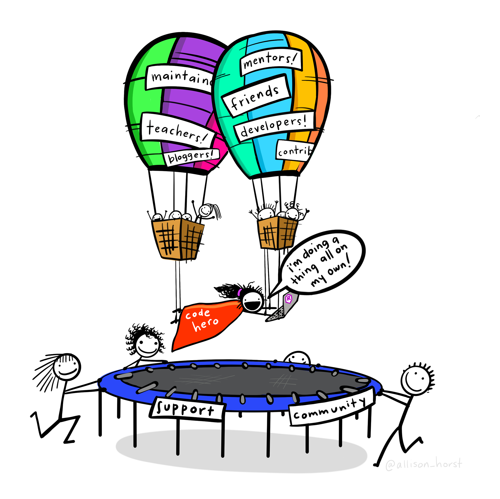
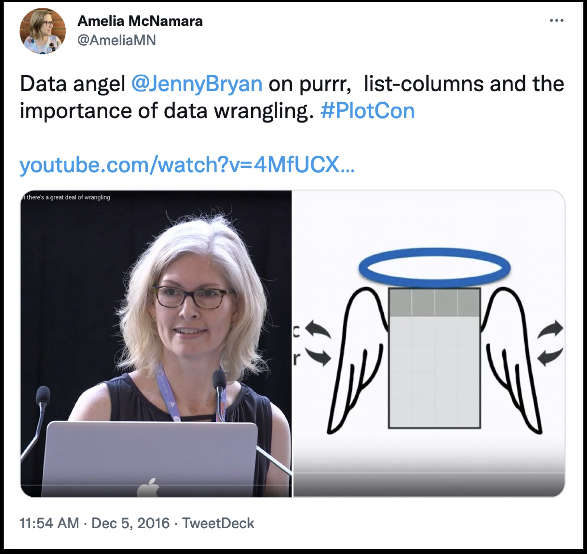
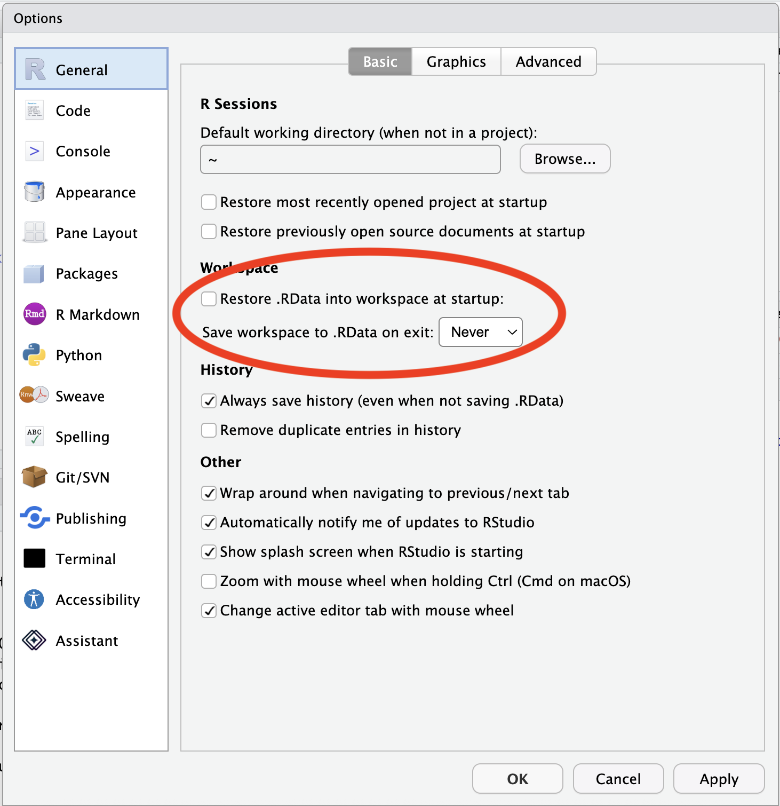
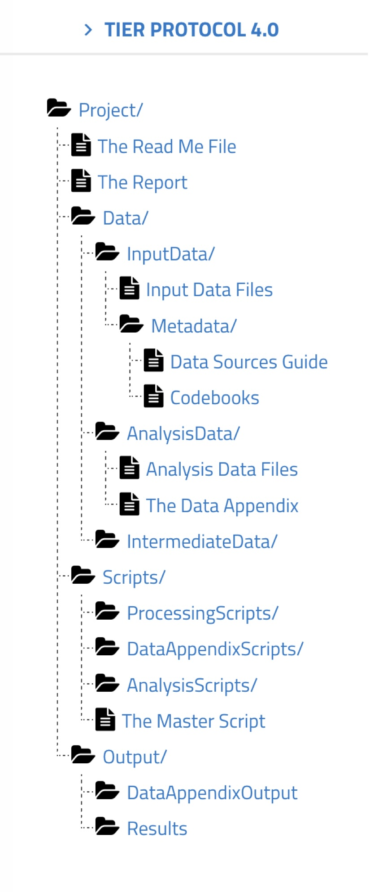

## About me

Blah

Materials modified from 

- [Building tidy tools](https://github.com/rstudio-conf-2022/build-tidy-tools) by Emma Rand + Ian Lyttle. 
- [uncoast::unconf](https://github.com/uncoast-unconf/uu-2019-day-zero) by Amelia McNamara, Haley Jeppson, Ian Lyttle, and Yihui Xie.

---


::: {footnote}

Artwork by [Allison Horst](https://allisonhorst.com/everything-else)

:::


## "Everything I know is from Jenny Bryan"

:::: {.columns}

::: {.column width="50%"}

[mytwiterarchive](https://www.amelia.mn/mytwitterarchive/AmeliaMN/status/805832755372261377/)
:::

::: {.column width="40%"}

[EIKSFJB hex sticker](https://github.com/MonkmanMH/EIKIFJB)
:::

::::

## Prerequisite knowledge

I am assuming you have a baseline familiarity with

- R as a language
- Writing functions
- Markdown (RMarkdown/Quarto/plain Markdown)
- git/GitHub

## Catch up
I'll do a little bit of review of each of those topics, but if they are totally new to you, here is some background reading to help you get caught up. 

- R as a language
- Writing functions
  - DRY
  - [Functions](https://r4ds.hadley.nz/functions.html) chapter of R for Data Science
  - [What makes a good function?](https://www.youtube.com/watch?v=Qne86lxjgtg), Hadley Wickham
  - Nick Tierney's [Practical Functions, Practically Magic](https://github.com/njtierney/talk-funfun-slc)
- Markdown
  - [RMarkdown](https://r4ds.had.co.nz/r-markdown.html) (mostly deprecated at this point)
  - [Quarto](https://r4ds.hadley.nz/quarto.html)
  - [Markdown](https://daringfireball.net/projects/markdown/syntax)
- [git](https://happygitwithr.com/big-picture)/[Github](https://happygitwithr.com/usage-intro)

## Packages

We're going to be using the following packages, so make sure they are installed!

```{r, eval=FALSE}
install.packages(c("usethis", "roxygen2", "testthat"))
```


## Workflow

Starting from a blank slate
Relative paths
File organization

[tidyverse design principles](https://design.tidyverse.org/)

## Starting from a blank slate

We're going to strive not to be data-hoarders


Restore .RData into workspace at startup: unchecked

Save workspace to .RData on exit: Never

## File organization

- Files should be stored in folders (also called directories) in some intelligible way, and any references to files should be “relative” rather than “absolute” paths. e.g., 

    ../Data/InputData/some_file.csv, 
    
rather than 

    /Users/myUserName/Documents/Project/Data/InputData/some_file.csv


The TIER Protocol is one suggested organizational method



## Naming things

You need to name your files. 
Names should strive to be:

- machine readable
- human readable
- useful with default ordering

## Naming things

NO

- my abstract.docx
- Joe’s Filenames Use Spaces and Punctuation.xlsx
- figure I.png
- fig 2.png
- JW&^(2sl@deletethisandyourcareerisoverWx2*.txt

YES

- 2014-06-08_abstract-for-sla.docx
- joes-filenames-are-getting-better.xlsx
- fig01_scatterplot-talk-length-vs-interest.png
- fig02_histogram-talk-attendance.png
- 1986-01-28_raw-data-from-challenger-o-rings.txt
  
Via [Jenny Bryan](https://speakerdeck.com/jennybc/how-to-name-files)

## Set up your `.Rprofile`

The **`usethis`** package allows you to add default information about you that will be used in package development.

\

Edit your `.Rprofile` with `usethis::edit_r_profile`:\

```{r}
usethis::edit_r_profile()
```

\

to set the following options....

## Set up your `.Rprofile`

```{r}
#| eval: false
options(
  usethis.full_name = "Amelia McNamara",
  usethis.description = list(
    `Authors@R` = 'person("Amelia", "McNamara",
          email = "amelia.mcnamara@stthomas.edu",
          role = c("aut", "cre"))'
  )
)
```

## Set up your `.Rprofile`

Load **`devtools`** and **`testthat`** on start up

\

```{r}
if (interactive()) {
  suppressMessages(require(devtools))
  suppressMessages(require(testthat))
}

```

\

Restart R for these to take an effect.


## Functions


## Resources 

- [Happy git and GitHub for the useR](https://happygitwithr.com/), Jenny Bryan, the STAT 545 TAs, Jim Hester.
- [What They Forgot to Teach You About R](https://rstats.wtf/),  Jennifer Bryan, Jim Hester, Shannon Pileggi, E. David Aja. 
- Object of type ‘closure’ is not subsettable, Jenny Bryan. rstudio::conf [video](https://posit.co/resources/videos/object-of-type-closure-is-not-subsettable), [slides](https://speakerdeck.com/jennybc/object-of-type-closure-is-not-subsettable)
- [Code "smells" and feels](https://www.youtube.com/watch?v=7oyiPBjLAWY), Jenny Bryan
- [R for Data Science](https://r4ds.hadley.nz/), Hadley Wickham, Mine Çetinkaya-Rundel, and Garrett Grolemund. 
- [R packages](https://r-pkgs.org/), Hadley Wickham and Jenny Bryan. 