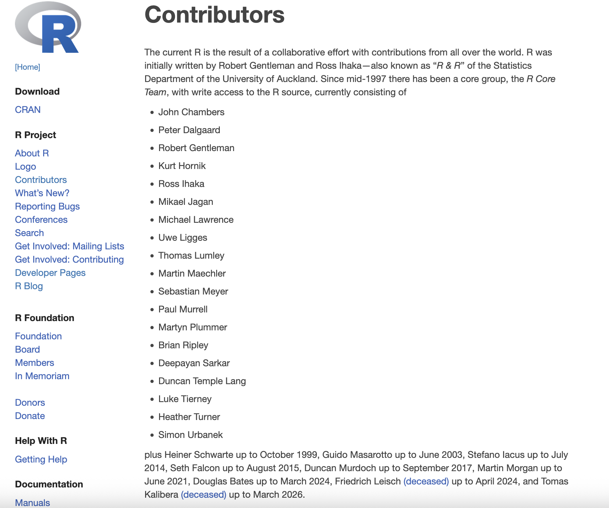
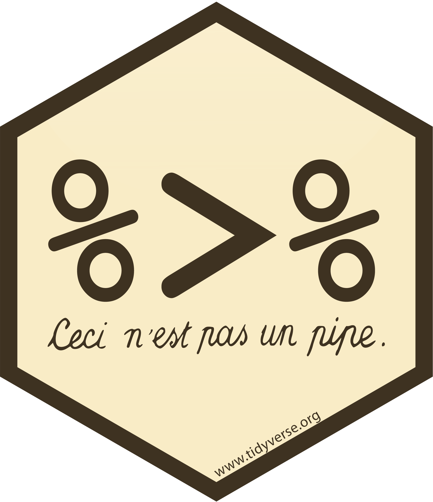
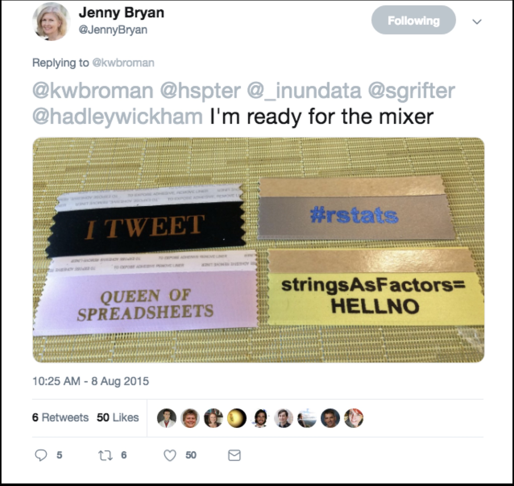
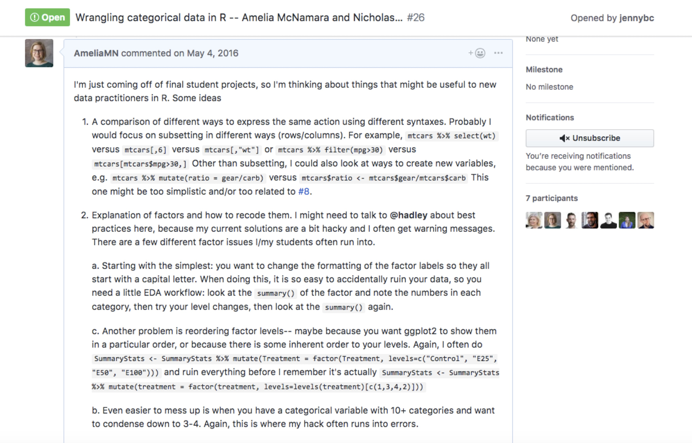

# "Recent" R developments

## R core



[R contributors](https://www.r-project.org/contributors.html)

# Native pipes

## "Ceci n'est pas un pipe"

**|** is often thought of as "the pipe" (as in unix), but we use that symbol to mean "or" in R. 
```r
dplyr::filter(penguins, species == "Adelie" | bill_length_mm > 50)
```

In 2014, the `{magrittr}` package added piping functionality to R. 

{height="100"}

This package name was a reference to René Magritte's [The Treachery of Images](https://en.wikipedia.org/wiki/The_Treachery_of_Images),

{height="20%"}

## Native R pipe

The `{magrittr}` pipe was wildly popular, and was likely one of the things that made the tidyverse take off. 

\

In 2021, R 4.1.0 introduced the native pipe operator, `|>`. Looking back at my own repos, I made the jump in 2023. 

\

If you're just doing data wrangling, you can basically do a find-and-replace for `%>%` with `|>`. Both pipes will pass the previous object in as the first argument of the function they're piping into. However, there are some differences with the more complex behavior. 

## Native vs. magrittr pipe

- the native pipe always requires parentheses for the function you are piping into. The magrittr pipe does not. 

```
x |> mean()

x %>% mean
```

- different placeholders. The magrittr pipe used `.` as the placeholder, the base pipe (as of 4.2.0) uses `_`. For the base pipe, the argument you are passing the placeholder to must be named

```
x %>% f(1, .) # is equivalent to
f(1, x)

x |> f(1, y = _) # is equvalent to
f(1, y = x)
```

## Dependency implications

Many R purists like the base pipe because it "doesn't require any dependencies." But actually it has a big dependency-- you need R > 4.1.0! 

\

This used to be a bigger deal-- when the native pipe was introduced, the [tidyverse versioning policy](https://tidyverse.org/blog/2019/04/r-version-support/) said they needed to support back to 3.5.0. Now, the versioning policy says they only need to support back to 4.2.0. 

\

Still, something to consider. 

# Strings as factors

## stringsAsFactors = TRUE

Back in the day, the Global option `stringsAsFactors` was set as `TRUE`. As with many idiosyncrasies of R, this was 'for backward compatibility with S.'

\

With `stringAsFactors = TRUE`, all character strings got read into R as factor variables. This makes sense for variables like race, gender, and other standard categorical variables with just a few levels. But if you're working with text data that has many unique strings, it does not!

## stringsAsFactors = TRUE
Factors behave in somewhat unexpected ways, so it's also easy to wreck your data while using them.

```{r, eval=TRUE}
x <- c(20, 20, 10, 40, 10)
x
xf <- factor(x)
xf
as.numeric(xf)
```


## stringsAsFactors = HELLNO

This was... a big deal in the R community for a long time

{width=50%}

## Wrangling Categorical Data in R without Losing Your Mind

I actually wrote a paper on this (with Nick Horton) and gave a talk about it at rstudio::conf 2019.




## Wrangling Categorical Data in R without Losing Your Mind

I actually wrote a paper on this (with Nick Horton) and gave a talk about it at rstudio::conf 2019.


## Wrangling Categorical Data in R without Losing Your Mind {.smaller}

> I think the example that broke for me most-embarassingly (was on a take-home exam) did the following:
>
    - had a categorical variable that wasn't originally coded as a factor (but as character)
    - data was split into test/training. Some of the training had levels that weren't in the test data and vice versa! So let's say for argument's sake that both test and training had 4 different levels for the variable, but only 3 intersecting levels. E.g., test: red, blue, green, brown; training: red, blue, green, yellow.
    - the variable was made into a factor to do the classification (I think I even used as.factor() in the classification algorithm / sample code).
    - then with the test data, everything worked perfectly (read: no R errors), but it was totally WRONG
>
> -- [external reviewer for paper](https://github.com/dsscollection/factor-mgmt/issues/20)


## stringsAsFactors = FALSE

If you have never run into issues with factors, thank the tidyverse, specifically `{readr}` and `{forcats}`.  

\ 

And then thank R Core, because in R 4.0.0 they decided to set `stringsAsFactors = FALSE` by default! 

## Why use factors? 

Factors are mostly useful when it comes to modeling (`lm()` and its family of functions use factors to set reference levels) and plotting (if you want to perfect your `ggplot` you will probably eventually need to reorder some factor levels). 


# Package states

## Package states

There are five states a package can be in:

- source

- bundled

- binary

- installed

- in-memory

::: aside
Having a understanding of the different states a package can be helpful in understanding package development.
:::

## Package states

{fig-alt="schematic of package states and the functions that move them between states. One the horizontal axis: source, bundle, binary, installed, in memory. One the vertical axis the functions install.packages, R CMD install, install, build, install_github"}

::: aside
Figure from [R Packages](https://r-pkgs.org/) [@wickham2020]
:::

## Package states

::::: columns
::: {.column width="40%"}
- ::: {style="background-color: #707070"}
  source
  :::

- bundled

- binary

- installed

- in-memory
:::

::: {.column style="width: 60%; background-color: #707070"}
What you create and work on.

Specific directory structure with some particular components e.g., `DESCRIPTION`, an `R/` directory.
:::
:::::

## Package states

::::: columns
::: {.column width="40%"}
- source

- ::: {style="background-color: #707070"}
  bundled
  :::

- binary

- installed

- in-memory
:::

::: {.column style="width: 60%; background-color: #707070"}
Also known as "source tarballs".

Package files compressed to single file.

Conventionally `.tar.gz`

You don't normally need to make one.

Unpacked it looks very like the source package
:::
:::::

## Package states

::::: columns
::: {.column width="40%"}
- source

- bundled

- ::: {style="background-color: #707070"}
  binary
  :::

- installed

- in-memory
:::

::: {.column style="width: 60%; background-color: #707070"}
Package distribution for users w/o dev tools

Also a single file

Platform specific: `.tgz` (Mac) `.zip` (Windows)

Package developers submit a bundle to CRAN; CRAN makes and distributes binaries

`install.packages()`
:::
:::::

## Package states

::::: columns
::: {.column width="40%"}
- source

- bundled

- binary

- ::: {style="background-color: #707070"}
  installed
  :::

- in-memory
:::

::: {.column style="width: 60%; background-color: #707070"}
A binary package that's been decompressed into a package library

Command line tool `R CMD INSTALL` powers all package installation
:::
:::::

## Package states

::::: columns
::: {.column width="40%"}
- source

- bundled

- binary

- installed

- ::: {style="background-color: #707070"}
  in-memory
  :::
:::

::: {.column style="width: 60%; background-color: #707070"}
If a package is installed, `library()` makes its function available by loading the package into memory and attaching it to the search path.

We do not use `library()` for packages we are working on

`devtools::load_all()` loads a source package directly into memory.
:::
:::::

# Tidy design philosophy

## Tidy design philosophy

Not as fleshed-out as the tidyverse style guide, but also [developed as a book](https://design.tidyverse.org). 

## Minimal names

In R, you can have unnamed objects

```{r, eval=TRUE}
x <- letters[1:3]
names(x)
```

but, this means that sometimes the `length(names())` is 0, and other times it is the same length as the length of `x`. We strive for more consistency!

`{rlang}` offers a solution,

```{r, eval=TRUE}
rlang::names2(x)
```

These are minimal names-- even though they are all empty strings, the length of `names()` will always be the same length as `x`. 

## Unique names

In base R, there is a function `make.unique()`, which can be used to create unique names (no duplicates). 

For the tidyverse, there are low-level functions `vctrs::vec_names()` and `vctrs::vec_names2()`, used by things like the `.names_repair` argument in `tibble()` and `names_repair` in `read_csv()`. Some options are `minimal`, `unique`, and `universal` (unique and syntactic). 


``` default
## Original Unique names     Result of
##    names  (tidyverse) make.unique()
##       ""         ...1            ""
##        x        x...2             x
##       ""         ...3            .1
##      ...         ...4           ...
##        y            y             y
##        x        x...6           x.1
```

The reason for avoiding `..j` is it already has syntactic meaning in R, as a way to refer to arguments passed down from a calling function. 

## Why dots?

The underscore `_` was also considered when choosing the tidyverse suffix strategy, but was rejected.

Why? Because syntactic names can’t start with an underscore and we want the suffix itself to be syntactic. Also, the dot `.` is already used by base R’s `make.names()` to replace invalid characters. It seems simpler and, therefore, better to use the same character, in the same way, as much as possible in name repair. We use the dot `.`, we put it at the front, as many times as necessary.

## Syntactic names

You have probably encountered non-syntactic names before. If a variable name has a space in it, for example, it becomes non-syntactic.

```{r, eval = TRUE, error=TRUE}
x <- tibble::tibble(`Physicians per 100,000 Population` = 514)
x |>
  pull(Physicians per 100,000 Population)
x |>
  dplyr::pull(`Physicians per 100,000 Population`)
```


## Pure function

A function where:

 - the return value depends *only* on argument values

 - only change is the return value

. . .

Examples:

. . .
 
```r
function(x, y) {
  x + y
}
```

. . .
 
```r
cos(pi)
```

## Side effects

A function where:

 - the return value can depend on "the outside universe"

 - there is a change in the "the outside universe"
 
. . .

Examples:

. . .

```r
readr::read_csv("myfile.csv")
```

. . .

```r
runif(1)
```

## Why is this important?

. . . 

- Pure functions easier to test than functions with side effects.

. . . 

- Side effects (interactions with universe) take time (Shiny).

. . . 

- Functions with side effects should document the effects.

. . . 

- Side effects are not inherently bad (we *do* need to write to the file system),
  but they need extra care.
  
  
## Make a function with side effects

So far, our functions have been pure. Let's make one that is not. For this function, I want to write a wrapper around `imputeTS::ggplot_na_distribution()`. This function has the name `ggplot` in the title, but it doesn't work like a normal `ggplot()` function (taking the data as the first argument, then `aes`thetics). 

. . .

Do you remember the `usethis` function that will open up a .R file for us to write `BLT_ggplot_na_distribution.R`?

. . . 

```{r}
usethis::use_r()
```


Let's start with adding a function skeleton,

. . .

```r
BLT_ggplot_na_distribution <- function(data, mapping, ...){

}
```

. . . 

And then write some documentation **first**, as is better practice. 

## Make a function with side effects

::: extrasmall
```r
#' ggplot to visualization the distribution of missing values
#'
#' Wrapper around [imputeTS::ggplot_na_distribution]
#'
#' @param data Default dataset to use for a plot
#' @param variable The variable to plot
#' @param ... Other arguments passed on to methods
#'
#' @returns a ggplot object
#' @export
#'
#' @examples
#' tomatoes |>
#' BLT_ggplot_na_distribution(value)
BLT_ggplot_na_distribution <- function(data, variable, ...){

}
```
:::


## Make a function with side effects

::: extrasmall
```r
#' ggplot to visualization the distribution of missing values
#'
#' Wrapper around [imputeTS::ggplot_na_distribution]
#'
#' @param data Default dataset to use for a plot
#' @param variable The variable to plot
#' @param ... Other arguments passed on to methods
#'
#' @returns a ggplot object
#' @export
#'
#' @examples
#' tomatoes |>
#' BLT_ggplot_na_distribution(value)
BLT_ggplot_na_distribution <- function(data, variable, ...){
  var <- rlang::enquo(variable)
  var_eval <- rlang::eval_tidy(var, data = data)
  imputeTS::ggplot_na_distribution(var_eval)
}
```
:::


## Practical advice

Try to separate tasks into pure functions and side effects:

- easier to test the pure functions and side effects separately

- use *these* functions in higher-level functions


## Name all but the most important arguments

When calling a function, you should name all but the most important arguments. For example:

```{r, eval = TRUE}
y <- c(1:10, NA)
mean(y, na.rm = TRUE)
```

Never use partial matching,

```{r, eval = TRUE}
mean(y, n = TRUE)
```

## Teaching exception

When you are teaching, it is best practice to start by naming all arguments, and then relax into the other standard.

At the beginning of a course:
```{r}
ggplot(data = mpg, mapping = aes(x = displ, y = hwy)) + 
  geom_point()
```

By the end:
```{r}
ggplot(mpg, aes(displ, hwy)) + 
  geom_point()
```

## Hidden arguments

A common source of hidden arguments is the use of global options:

- `stringsAsFactors`. This has been largely solved by R 4.0.0, which set `stringsAsFactors = FALSE` by default. Learn more in [stringsAsFactors: An unauthorized biography](https://simplystatistics.org/posts/2015-07-24-stringsasfactors-an-unauthorized-biography/) by Roger Peng and [stringsAsFactors = <sigh>](https://simplystatistics.org/posts/2015-07-24-stringsasfactors-an-unauthorized-biography/) by Thomas Lumley.

- `na.action`. This continues to be an issue with functions like `lm()`, whose handling of missing values depends on the global option of `na.action`. The default is `na.omit` which drops the missing values prior to fitting the model (which is inconvenient because then the results of `predict()` don’t line up with the input data.

- system locale. Check with `Sys.getlocale()`

## Make inputs explicit

The way to avoid issues with these common hidden arguments is to make them explicit. 

Here's a wrapper for `as.POSICct()` that just shows how the arguments in the original function work:

```{r}
as.POSIXct <- function(x, tz = "") {
  base::as.POSIXct(x, tz = tz)
}
as.POSIXct("2026-08-17 09:00")
```

There is a `tz` argument, but it's not clear that `""` means our local time zone. It would be better practice to be more explicit,

```{r}
as.POSIXct <- function(x, tz = Sys.timezone()) {
  base::as.POSIXct(x, tz = tz)
}
as.POSIXct("2026-08-17 09:00")
```


## Summary

. . .

- **Naming**: be consistent, concise, yet evocative.

. . .

- **Argument order**: data, descriptors, dots, details.
  
. . .

- **Return value type**: be consistent, predictable.

. . .

- Easy to remember data (first) argument and return value:
  - easy to use pipe, `|>`.

. . .

- Be mindful of side effects.

## Errors

- The most common type of side-effect is the **error condition**. 

. . .

- Sometimes, error messages can be cryptic: 

  ```r
  seq[10]
  ```

  ```
  Error in seq[10] : object of type 'closure' is not subsettable
  ```

. . . 


- You can write error messages that make things clearer for: 
  - developers who call your functions
  - end users
  
Object of type 'closure' is not subsettable, Jenny Bryan. rstudio::conf [video](https://posit.co/resources/videos/object-of-type-closure-is-not-subsettable), [slides](https://speakerdeck.com/jennybc/object-of-type-closure-is-not-subsettable)

## Creating an error condition 

An effective error condition has:

- **predicate** (logical expression used to identify condition)
- clear **message** for end user
- **class name** for developer
- **more information** for developer

## Using `cli::cli_abort()`

{cli} package 

```r
# predicate
if (y > 3) {
  cli::cli_abort(
    # message for end user
    c(
      "{.var y} cannot be greater than 3.", 
      x = "{.var y} is {.val {y}}."
    ),
    # class name
    class = "BLT_error_threshold",  
    # more information
    y = y     
  )
}
```

## Predicate

Prefer:

 - simpler predicates and more error-conditions
 
Over:

 - complex predicates and fewer error-conditions
 
. . .

Finding simplest set of predicates is just as challenging as finding the "right" names for functions and arguments.

## Message

Content:

- how did we violate the predicate?

. . . 

Formatting:

- {cli} provides powerful formatting tools:

  - use curly-braces and a tag, e.g. `{.var y}` 
  - use more curly-braces to interpolate, e.g. `{.val {y}}`
  
- see [cli inline-markup](https://cli.r-lib.org/reference/inline-markup.html) for more details.

## Class name

- A developer, calling your function, can use the `class` name to handle the error, if they want.

- Convention: 
  
  - `"{package}_error_{description}"`

## Additional information

This "stuff" is also available to an error handler.

- Provide the data that went into the predicate.

- Provide name of variable, e.g. `y = y`.

- Avoid reserved names: `message`, `class`, `call`, `body`, `footer`, `trace`, `parent`, `use_cli_format`.

## Validation

If there will be an error, surface it quickly.

Validating the arguments to a function is one way to do this.

. . .

For example:

 - is *this* a data frame?
 - does this data frame have *these* columns?

. . . 
 
Questions like these can be generalized into functions:

 - throw an error if you need to.
 - otherwise, return **data** argument invisibly.
 
## Validate string-values 

You may be familiar with `match.arg()`:

 - uses "magic" to compare value (if any) to default
 - argument default is vector of strings
   - if value among defaults, return it - otherwise **error**
   - if no value, return *first* value in default

. . .

`rlang::arg_match()` does the same thing, but:

  - partial match triggers error
  - error messages conform to tidyverse standards

## Snapshot tests

Designed for capturing side-effects:

 - error messages
 - `dplyr::glimpse()` is a useful shortcut
 
. . .  
 
Be careful about accepting changes (don't just accept).

Can be temperamental - not run on CRAN.

We will go through, using examples.
   


<!-- ## Build error constructor {.smaller} -->

<!-- - `usethis::use_package("cli")` -->

<!-- - review `validate_data_frame()` (`call` argument) -->

<!-- - build constructor for `validate_cols()`: -->
<!--   - something like `{.field {cols}}` may be useful -->
<!--   - activate `2.2.1` tests in `test-validate.R`, as you go -->

<!-- - hold off on snapshot test (we'll do together) -->

<!-- . . . -->

<!-- - add validator-functions to `uss_make_matches()`: -->
<!--   - `matches.R` -->
<!--   - `cols_engsoc()` may be useful -->

## Managing global state

Leave no footprints.

Leave the global state how you found it, avoid surprises later:

 - packages loaded
 - also: options, environment variables 

. . .

Loading {devtools} in `.Rprofile` changes the global state.

. . .

When we hit the "Knit" button, or the Quarto "Render" button:

  - it runs in a *new* R session
  - does not execute user's `.Rprofile`
  
## Using "self-removing footprints"

The {withr} package gives us tools to:

 - modify global state
 - specify when to reverse the modification

. . . 
 
Useful family of functions:

 - `withr::local_*()`
 - changes the state back when a scope is exited
 - if called within a function, *normally* when the function exits

## When could this be useful?

CRAN is (rightly) particular about "leave no footprints".

You may need:

 - `withr::local_options()`: change an option
 - `withr::local_dir()`: change the working directory
 - `withr::local_tempfile()`: path to a temporary file
 
. . . 

Useful in `testthat` code and in `R` code.

## Interactive example

```{r}
write_read_vanish <- function(x) {
  
  tempfile <- withr::local_tempfile(fileext = ".rds")
  
  saveRDS(x, file = tempfile)
  xnew <- readRDS(tempfile)
  
  print(
    glue::glue("'{tempfile}' contained {xnew}.")
  )
  
  invisible(xnew)
}
```

## Another interactive example

```r
not_runif <- function(n, min = 0, max = 1) {

  withr::local_seed(314)
  
  runif(n, min = min, max = max)
}
```

## Example

- `usethis::use_test("validate")`
- change: 

  ```r
  expect_identical(error_condition$cols_req, "foo")
  ```
  
- to: 

  ```r
  expect_identical(error_condition$cols_re, "foo")
  ```

- rerun tests 🤔

. . . 

- By default, `$` accepts partial matching.

- We want stricter testing, so we need to set some options.


## Test a function with side effects 

It's much harder to write tests for functions that have side effects. But, there are some new helpers out there. `vdiffr` is what is being used to test `ggplot2`. It has the function `expect_doppleganger()` that can compare snapshots of figures. 


Do you remember the `usethis` function that will make a test file for us?

. . . 

```r
 usethis::use_test()
```

. . . 

```r
test_that("plots have known output", {

  tomato_NA_dist <- BLT_ggplot_na_distribution(tomatoes, value)
  vdiffr::expect_doppelganger("tomato_NA_dist", tomato_NA_dist)
})
```

. . .

```r
test()
```

does it pass?

## Test a function with side effects 

If you want to see it break, we can change the dataset in the test

```r
test_that("plots have known output", {

  tomato_NA_dist <- BLT_ggplot_na_distribution(bacon, value)
  vdiffr::expect_doppelganger("tomato_NA_dist", tomato_NA_dist)
})
```

. . .

```r
test()
```

Should fail!

## Commit

Now would be a good time to commit your changes 

{fig-alt="Git icon" width="300"} 


## Pass the dots

This is the simplest possible solution. 

. . .

 - If the tidyverse function you're using takes `...` as an argument,

. . .

 - and that's what you want to pass along, 

. . . 
 
then you can **pass the dots**.

```r
my_select <- function(.data, ...) {
  dplyr::select(.data, ...)
}
```

## Data in packages

There is a lot more detail specific to including data in packages. Sometimes you want to include raw data, sometimes you need data only available to the package and not the user, etc. There is much more detail in the [R packages](https://r-pkgs.org/data.html) book. 

## Summary

. . .

The most-common side-effect is an error. Good design:

. . .

- simple (as possible) predicate
- clear message
- add a `class` using naming convention, and additional information

. . .

Use snapshot tests to capture side-effects.

- be very careful when accepting changes to snapshots.

. . . 

Use `withr::local_*()` functions to "leave no footprints".


## Resources

- [Best Practices for Scientific Computing](https://journals.plos.org/plosbiology/article?id=10.1371/journal.pbio.1001745)
- [Good enough practices in scientific computing](https://journals.plos.org/ploscompbiol/article?id=10.1371/journal.pcbi.1005510)
- Object of type 'closure' is not subsettable, Jenny Bryan. rstudio::conf [video](https://posit.co/resources/videos/object-of-type-closure-is-not-subsettable), [slides](https://speakerdeck.com/jennybc/object-of-type-closure-is-not-subsettable)

- [Code "smells" and feels](https://www.youtube.com/watch?v=7oyiPBjLAWY), Jenny Bryan

- [https://tidyverse.org/blog/2023/04/base-vs-magrittr-pipe/](https://tidyverse.org/blog/2023/04/base-vs-magrittr-pipe/), Hadley Wickham
- [stringsAsFactors: An unauthorized biography](https://simplystatistics.org/posts/2015-07-24-stringsasfactors-an-unauthorized-biography/) by Roger Peng 
- [stringsAsFactors = <sigh>](https://simplystatistics.org/posts/2015-07-24-stringsasfactors-an-unauthorized-biography/) by Thomas Lumley.