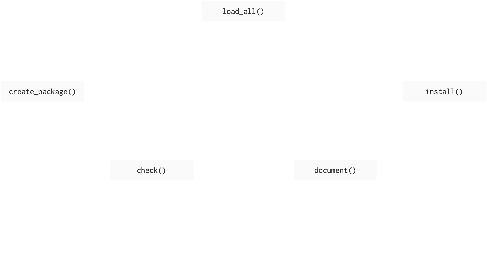
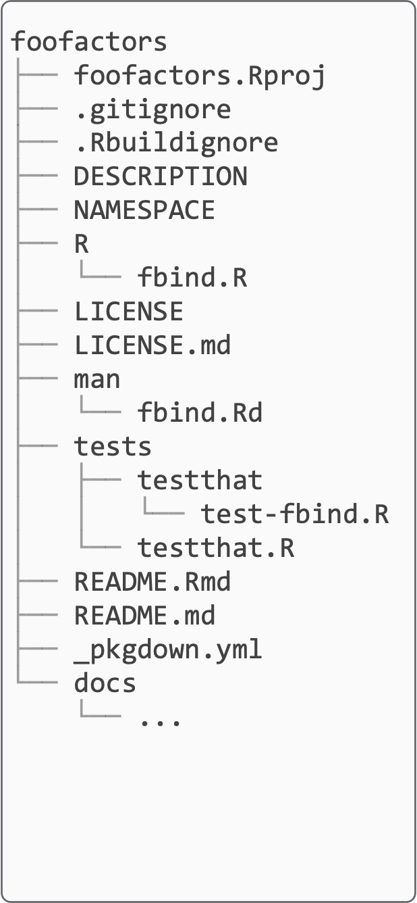
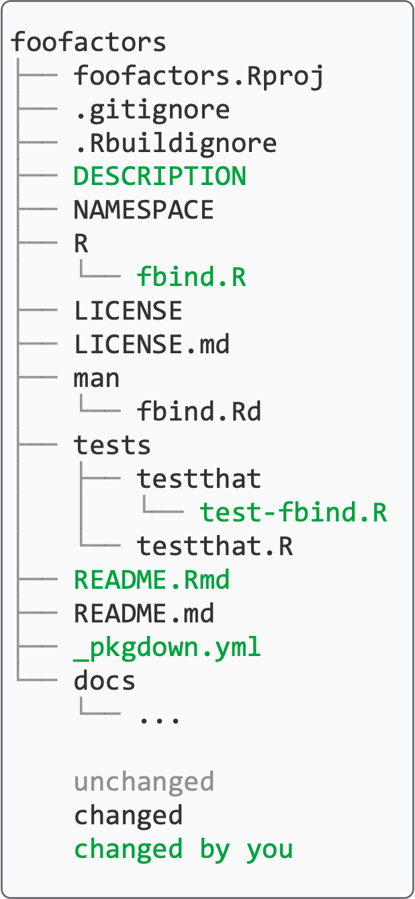
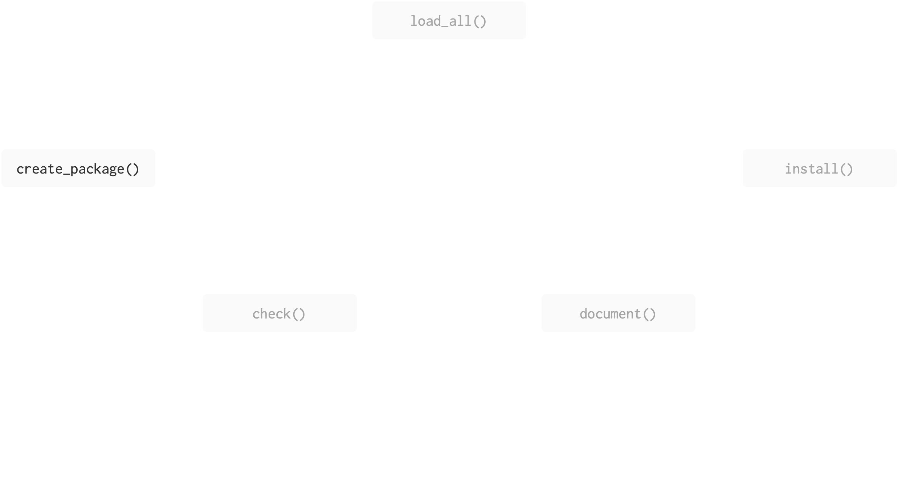
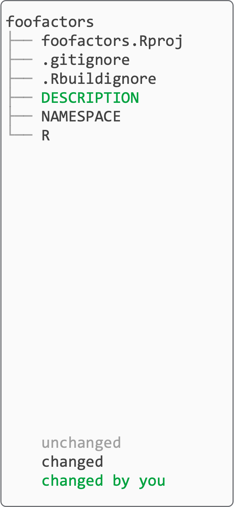
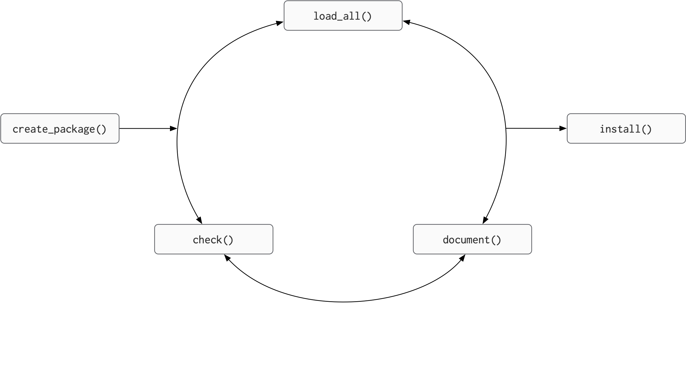
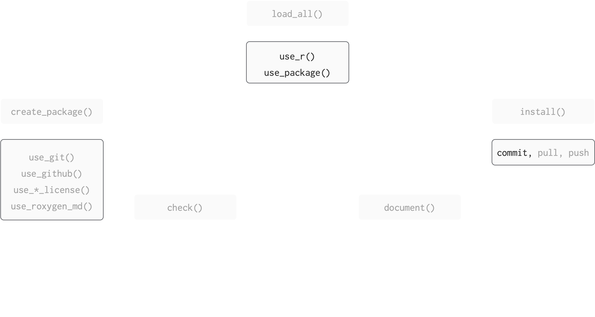
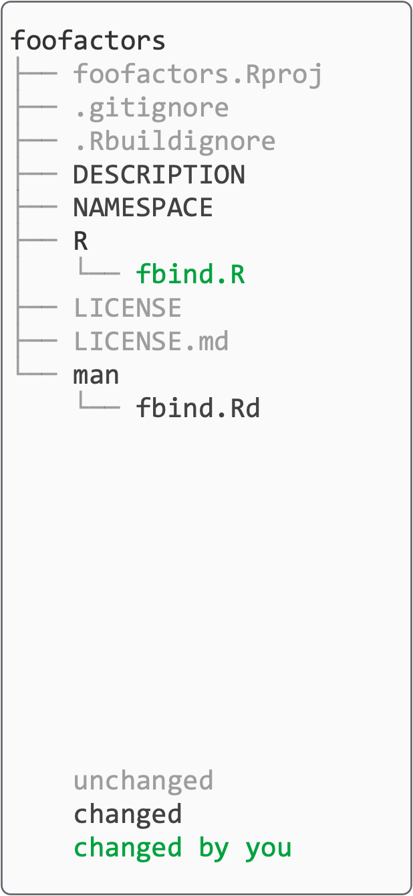

## Motivation
In the R world, versions of this are attributed to Hadley Wickham:

> Any time you copy-and-paste code three times, write a function.

> Any time you copy-and-paste a function three times, write a package.

Also known as the [rule of three](https://en.wikipedia.org/wiki/Rule_of_three_(computer_programming)): popularized by Martin Fowler (1999), attributed to Don Roberts


# Why make a package?


## Why make a package

- makes it easier to reuse functions you write
- have a consistent framework which encourages you to better organise, document and test, your code
- using this consistent framework means you can use many standardised tools
- is the easiest way to distribute code and data

## Be nice to future you

> In every project you have at least one other collaborator; future-you. You don’t want future-you to curse past-you
>
> - [Hadley Wickham](https://www.r-bloggers.com/2016/05/your-most-valuable-collaborator-future-you/)

## To avoid

<iframe src="https://giphy.com/embed/M11UVCRrc0LUk" width="960" height="554" frameBorder="0" class="giphy-embed" allowFullScreen>

</iframe>

<p><a href="https://giphy.com/gifs/M11UVCRrc0LUk">via GIPHY</a></p>

## Script vs package

::: columns
::: {.column width="35%"}
### Script

-   one-off data analysis
-   defined by `.R` extension
-   `library()` calls
-   documentation in \# comments
-   `source()`
:::

::: {.column width="65%"}
### Package

-   defines reusable components
-   defined by presence of `DESCRIPTION` file
-   Required packages specified in `DESCRIPTION`, made available in `NAMESPACE` file
-   documentation in files and `Roxygen` comments
-   Install and restart
:::
:::

## Overview

::: {.teach-left}
```{r verb-base, echo=FALSE, fig.align='left'}

```
:::

::: {.teach-right} 
```{r noun-prelim, echo=FALSE, fig.align='right'}

```

[(Does this remind you of anything?)]{style="font-size: 0.6em;"}
:::

::: footer 
Figure adapted from [Packages](https://github.com/hfrick/presentations/blob/master/2019-03-12_package_building/2019-03-12_package_building.pdf), by Hannah Frick
:::


## Overview

::: {.teach-left}
```{r verb-base-2, echo=FALSE, fig.align='left'}

```
:::

::: footer 
Figure adapted from [Packages](https://github.com/hfrick/presentations/blob/master/2019-03-12_package_building/2019-03-12_package_building.pdf), by Hannah Frick
::: 


::: {.teach-right} 
```{r noun-all, echo=FALSE, fig.align='right'}

```
[(Does this remind you of anything?)]{style="font-size: 0.6em;"}
:::


## Create package

<!-- Fix graffle -->

::: {.teach-left}
```{r verb-create-package, echo=FALSE, fig.align='left'}

```
:::

::: {.teach-right} 
```{r noun-create-package, echo=FALSE, fig.align='right'}

```
:::


## Create package (your turn)

Be deliberate about where you create your package
\
\

Do **not** nest inside another RStudio project, R package or git repo.
\
\

That includes if you created an RStudio project for these materials!
\
\

My practice is to put all packages under my home directory, but your Documents folder is also okay (as long as that's not synced by OneDrive or other file-tracking software!). 

## `create_package()`

What happens when we run `create_package()`?

-   R will create a folder called `BLT` which is a package and an RStudio project

-   restart R in the new project

-   create some infrastructure for your package

-   start the RStudio Build pane

::: aside
continued.....
:::

## `create_package()`

What happens when we run `create_package()`?

-   `BLT.Rproj`

-   `DESCRIPTION` provides metadata about your package.

-   The `R/` directory is where we will put `.R` files with function definitions.

-   `NAMESPACE` declares the functions your package exports and the functions your package imports from other packages.

::: aside
continued.....
:::

## `create_package()`

What happens when we run `create_package()`?

-   `.Rbuildignore` lists files that we need but that should not be included when building the R package from source.

-   `.gitignore` anticipates Git usage and ignores some standard, behind-the-scenes files created by R and RStudio.

::: aside
continued.....
:::

## Create package (your turn)

::: {.teach-left}

```r
create_package("../BLT") # set the path to suit you
# getwd() will remind you where you currently are
```

- creates a minimal set of files for an installable package

- opens a new RStudio project

:::

::: {.teach-right} 
```{r}
#| ref.label: noun-create-package
#| echo: false
```
:::

## Create framework

::: {.teach-left}
```{r verb-framework, echo=FALSE, fig.align='left'}

```
:::


::: {.teach-right} 
```{r noun-framework, echo=FALSE, fig.align='right'}

```
:::


## Make package a git repo (your turn)

::: {.teach-left}
```r
use_git()
```

- creates a git repository in your (package) project

- makes a first commit on your behalf

- restarts RStudio

:::

<!-- Fix graffle -->

::: {.teach-right} 
```{r}
#| ref.label: noun-framework
#| echo: false
```
:::


## Make package a git repo (your turn)

::: {.teach-left}
you will get some messages sort of like this:


```r
use_git()
```

```{.r style="font-size: 0.6em;"}
✔ Setting active project to "/Users/amcnamara2/BLT".
✔ Initialising Git repo.
✔ Adding ".Rhistory", ".RData", ".httr-oauth", ".DS_Store", and ".quarto" to .gitignore.
ℹ There are 5 uncommitted files:
• .gitignore
• .Rbuildignore
• BLT.Rproj
• DESCRIPTION
• NAMESPACE
! Is it ok to commit them?

1: No
2: Absolutely not
3: Yup
```

The specific language and order of items will change over time, to make it harder to make mistakes! 

Choose the option that means yes!

::: 

<!-- Fix graffle -->
::: {.teach-right} 

```{r}
#| ref.label: noun-framework
#| echo: false
```
:::


## [Create framework (we're skipping this)]{style="color: #888888;"} {style="color: #888888;"}

::: {.teach-left}

```r
use_github()
```

- this is the closest you may see to **actual** magic:

  - creates GitHub repository

  - creates git remote `origin`, sets to GitHub repository

  - pushes your `master` branch to git remote

  - adds information to `DESCRIPTION` file

  - opens your repository page at GitHub

:::

<!-- Fix graffle -->
::: {.teach-right} 
```{r}
#| ref.label: noun-framework
#| echo: false
```
:::


## Edit `DESCRIPTION` (your turn)

::: {.teach-left}

Open `DESCRIPTION` file to edit it:

- `Authors@R` field uses `options("usethis.description")` 

   - we set this in our `.Rprofile`, so go back to the intro slides if you missed this!
   - (Another possible issue is you didn't restart R!)

✏️ edit `Title` field. Should be one line, title case, with no period. Fewer than 65 characters.

💾 save `DESCRIPTION` file

:::

::: {.teach-right} 
```{r}
#| ref.label: noun-create-package
#| echo: false
```
:::

## Edit `DESCRIPTION`

::: small
``` default
Package: BLT
Title: Work with data on bacon, lettuce, and tomatoes
Version: 0.0.0.9000
Authors@R: 
    person("Amelia", "McNamara", , "amelia.mcnamara@stthomas.edu", role = c("aut", "cre"))
Description: What the package does (one paragraph).
License: `use_mit_license()`, `use_gpl3_license()` or friends to pick a
    license
Encoding: UTF-8
Roxygen: list(markdown = TRUE)
RoxygenNote: 7.3.3
```
:::


## Commit

Now would be a good time to commit your changes.

\


{fig-alt="Git icon" width="300"} 


## Create framework (your turn)

::: {.teach-left}

```r
use_roxygen_md()
```

- makes it **much** easier to create and maintain your function documentation

  - lets you use a markdown-like syntax


:::

::: {.teach-right} 
```{r}
#| ref.label: noun-framework
#| echo: false
```
:::


## Develop

::: {.teach-left}
```{r verb-develop, echo=FALSE, fig.align='left'}

```
:::


::: {.teach-right} 
```{r noun-develop, echo=FALSE, fig.align='right'}

```
:::


## Develop (your turn) {.smaller}

There's a **`usethis`** helper for adding `.R` files!

::: {.teach-left}
```r
usethis::use_r("AR1")
```

I like the idea of documenting, then writing **functions**:

- claim what the function will do, then do it

- if your explanation is getting heavy, split into more functions

Start by writing a shell for the function:

```r
AR1 <- function(y) {
  
}
```

- place the cursor on the blank line between the `{` ✏️ `}` 

- RStudio IDE menu: **Code** > **Insert Roxygen Skeleton**

:::

::: {.teach-right} 

```{r}
#| ref.label: noun-develop
#| echo: false
```
:::


## Develop (your turn)

::: {.teach-left}

Complete the documentation:

::: small
```r
#' Convenience function to make first-order autoregressive model
#'
#' Wrapper around forecast::Arima 
#
#' @param y a univariate time series of class `ts`
#'
#' @returns See the arima function in the stats package
#' @export
#'
#' @examples
#'  (AR1(LakeHuron))
#'
AR1 <- function(y) {

}
```
::: 

:::

::: {.teach-right} 
```{r}
#| ref.label: noun-develop
#| echo: false
```
:::

We're going to talk a lot more about documentation, but it's good to get in the habit early. 


## Develop (your turn)

::: {.teach-left}

Write the function body:

```r
#' @examples
#'  (AR1(LakeHuron))
#'
AR1 <- function(y) {
  forecast::Arima(y, order = c(1, 0, 0), include.constant = TRUE)
}
```
:::

::: {.teach-right} 
```{r}
#| ref.label: noun-develop
#| echo: false
```
:::


## Develop (your turn)

::: {.teach-left}

```r
forecast::Arima(y)
```

☝️ Use this notation to be explicit about where R looks for the function `Arima()`.


----

💾 Save `AR1.R`.

```r
document()
load_all()
check()
```

🤔 What happened?

:::

::: {.teach-right} 
```{r}
#| ref.label: noun-develop
#| echo: false
```
:::

## Develop (your turn) {.smaller}

::: small

```r
❯ checking DESCRIPTION meta-information ... WARNING
  Non-standard license specification:
    `use_mit_license()`, `use_gpl3_license()` or friends to pick a
    license
  Standardizable: FALSE

❯ checking dependencies in R code ... WARNING
  '::' or ':::' import not declared from: ‘forecast’

❯ checking for future file timestamps ... NOTE
  unable to verify current time

1 error ✖ | 2 warnings ✖ | 1 note ✖
```

:::


## Develop (your turn)


```r
use_package("forecast")
```

We need to specify that *our* package will use the **forecast** package:

- indicate a stronger reliance using `Imports` (default)

- indicate a weaker reliance using `Suggests` (test for package in functions)

Dependency management is a long-debated topic in the R community:

- for now, if you need to rely on a package, do it


## Develop 

```r
use_package("forecast")
```

```r
✔ Adding forecast to Imports field in DESCRIPTION.
☐ Refer to functions with `forecast::fun()`.
```

```r
document()
load_all()
check()
```


## Check

`R CMD check` is the gold standard for checking that an R package is in full working order.

\

It is a programme that is executed in the shell.

\

However, `devtools` has the `check()` function to allow you to run this without leaving your R session.

🎬 Check your package:

```{r, eval=FALSE}
devtools::check()
```

## Aside: in case of error

On running `devtools::check()` you may get an error if you are using a networked drive.

``` default
Updating BLT documentation  
Error: The specified file is not readable: path-to\BLT\NAMESPACE
```

\

This is covered [here](https://stackoverflow.com/questions/40530968/overwriting-namespace-and-rd-with-roxygen2) and can be fixed.

## Aside: in case of error

Save a copy of this file:

[fix_for_networked_drives.R](https://forwards.github.io/workshops/package-dev-modules/slides/03-your-first-package/fix_for_networked_drives.R)

Save it somewhere other than the `BLT` directory

Open the file from the `BLT` project session

Run the whole file

You should now find that `check()` proceeds normally

## Commit

Now would be a good time to commit your changes.

\


{fig-alt="Git icon" width="300"} 


## Experiment
Now that we've `document()`ed, `load_all()`ed and `check()`ed, we can try out our `AR1()` function in the console.

. . .

```r
AR1(tomatoes$value)
```

## Develop (again)

Now that we've made one function in our package, let's try making another. I'd like this function to find the percent of a time series that is missing. 

There are lots of approaches to this, I wrote a wrapper for `imputeTS::statsNA()`. 

Some functions you may find useful as you work: 

```r
use_r()
use_package()
document()
load_all()
check()
```

## Develop (again)

::: small
```default
#' Percent missing
#'
#' @param ts a timeseries object
#'
#' @returns the percent of missing observations in the time series
#' @export
#'
#' @examples
#' perc_missing(LakeHuron)
perc_missing <- function(ts){
  na_stats <- imputeTS::statsNA(ts, print_only = FALSE)

  return(na_stats$percentage_NAs)
}

```
:::

## Commit

Now would be a good time to commit your changes.

\


{fig-alt="Git icon" width="300"} 


## Develop (a third time)

Let's take this up one more notch by making our function take the dataset and variable name as two separate arguments, so we could use it in a tidy pipeline. 

Some functions you may find useful as you work: 

```r
use_r()
use_package()
document()
load_all()
check()
```

## Develop (a third time)

::: small
```
#' Percent missing, tidy version
#'
#' @param dataset is a dataset
#' @param variable is a time series variable within the dataset
#'
#' @returns the percentage of missing values in that time series
#' @export
#'
#' @examples
perc_missing_tidy <- function(dataset, variable){
  var <- substitute(variable)
  var_eval <- eval(var, envir = dataset)
  na_stats <- imputeTS::statsNA(var_eval, print_only = FALSE)
  tibble_perc <- tibble::tibble(perc = readr::parse_number(x = na_stats$percentage_NAs))
  return(tibble_perc)
}
```
:::

This one gets tricky because I can't find a good dataset to use in the example


## Commit

Now would be a good time to commit your changes.

\


{fig-alt="Git icon" width="300"} 


## Adding data to packages

Many packages come with example datasets bundled with them. There are many reasons for this, but the most salient is that if you include your own dataset you know it has exactly the features you need for examples and testing. 
\
\

The most common location for package data is `data/`. We recommend that each file in this directory be an `.rda` file created by `save()` containing a single R object, with the same name as the file. 
\
\

Of course, `usethis` has a helper function for this, `usethis::use_data()`.

## Adding data to packages (your turn)

Add the bacon data to the package,

```{r, eval=FALSE}
usethis::use_data(bacon)
```

```
✔ Adding R to Depends field in DESCRIPTION.
✔ Creating data/.
✔ Setting LazyData to "true" in DESCRIPTION.
✔ Saving "bacon" to "data/bacon.rda".
☐ Document your data (see <https://r-pkgs.org/data.html>).
```

## Documenting data

Data gets documented in the data.R file. How can we create and open this file for editing?

. . .

```{r, eval=FALSE}
devtools::use_r("data")
```

Unfortunately, the trick to insert Roxygen skeleton doesn't work with data, so we have to do the documentation more manually. 

## Documenting data

Here's what the `who` documentation in `tidyr` looks like

```
#' World Health Organization TB data
#'
#' A subset of data from the World Health Organization Global Tuberculosis
#' Report ...
#'
#' @format ## `who`
#' A data frame with 7,240 rows and 60 columns:
#' \describe{
#'   \item{country}{Country name}
#'   \item{iso2, iso3}{2 & 3 letter ISO country codes}
#'   \item{year}{Year}
#'   ...
#' }
#' @source <https://www.who.int/teams/global-tuberculosis-programme/data>
"who"
```

Can you write some documentation for the `bacon` data?

## Data in packages

There is a lot more detail specific to including data in packages. Sometimes you want to include raw data, sometimes you need data only available to the package and not the user, etc. There is much more detail in the [R packages](https://r-pkgs.org/data.html) book. 


## Resources

- [Happy git and GitHub for the useR](https://happygitwithr.com/), Jenny Bryan, the STAT 545 TAs, Jim Hester.
- Object of type ‘closure’ is not subsettable, Jenny Bryan. rstudio::conf [video](https://posit.co/resources/videos/object-of-type-closure-is-not-subsettable), [slides](https://speakerdeck.com/jennybc/object-of-type-closure-is-not-subsettable)
- [Code "smells" and feels](https://www.youtube.com/watch?v=7oyiPBjLAWY), Jenny Bryan
- [R packages](https://r-pkgs.org/), Hadley Wickham and Jenny Bryan. 
- [Evaluating the Design of the R Language](https://janvitek.org/pubs/ecoop12.pdf) This is for my computer scientists who want the nitty-gritty about R as a language
- [Advanced R](https://adv-r.hadley.nz/)
- [Package states](https://rstudio-conf-2022.github.io/build-tidy-tools/materials/day-1-session-1-introduction.html#/package-states)
